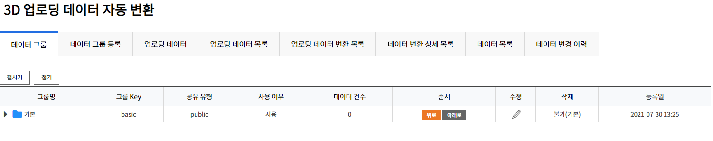
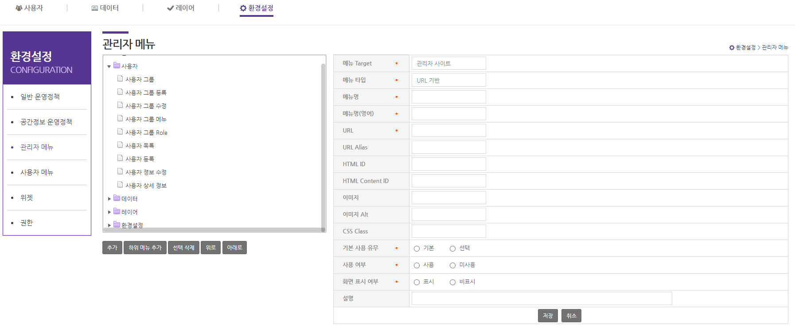
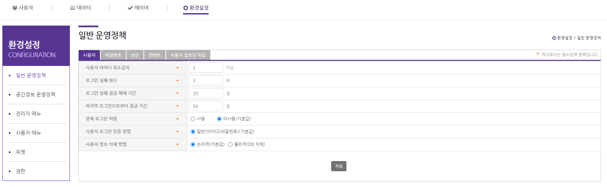

# Table of Contents

1. [Data Conversion and Visualization](#1-Data-Conversion-and-Visualization)
2. [Layer Service (Admin)](#2-Layer-Service-Admin)
3. [User Management (Admin)](#3-User-Management-Admin)
4. [Menus (Admin)](#4-Menus-Admin)
5. [Configuration (Admin)](#5-Configuration-Admin)

## 1. Data Conversion and Visualization

- **Tutorial Video**

[mago3D - 3D Data Conversion and Visualization](https://youtu.be/z3bUZA_jF4s)

- Data group

  

  

  - By default user can create extra groups as needed, with the group which has the group key called **basic**.

  - There are 4 sharing types; public, common, private, group. User can configure the group for data by these types.

- Data Upload

  

  - Supporting formats : CITYGML, INDOORGML, IFC, LAS(POINT CLOUD), 3DS, OBJ, COLADA(DAE)

  - User can upload data by selecting ZIP file or each files and specifying the upload location.

  - How to specify the height
    - Altitude : Use the height value which a user enters.
    - According to Terrain : Set the height according to the terrain.
    - Height from Terrain : Set the height above the terrain.

- Data Conversion

  

  - Select a file from uploaded files and click [F4D Conversion] button to convert it into F4D format.

- Data Visualization and Search

  

  - The uploaded object will be displayed on the map if the file conversion succeeds.

  - User can search data by group, type, and name.

## 2. Layer Service (Admin)

- **Tutorial Video**

[mago3D - 2D Layer Visualization](https://www.youtube.com/watch?v=uKpysHvppKM&t=979s) 

- Registering vector layer

  

  - Layer Registration function operates via GeoServer. Thus in the [Configuration] - [Operational Policy of Spatial Information] - **[GeoServer] tap, GeoServer of data URL must be running and workspace and stores must have been created.**

  

  - Vector layer registration supports shapefiles format. 
    - Modifying styles : Supports transparency, outline thickness, outline / fill color.
    - Modifying layer display order and Z-index : Layer display order is the order of layer list in the user page. The greater value, the lower display. Z-index means the order of overlapping layers.

- Registering raster layer

  

  - We do not support file upload function for raster data whose size is larger than shapefiles. The function to select and service from layer lists registered at GeoServer is supported.

- Setting Cache : For WMS services, when the status of "Use Cache" is **use** we service data cached by geowebcache and when **not use** we use the general WMS service.

## 3. User Management (Admin)

- User group : All users have their own group; the menus and permissions available are up to that group.

- Menu management : Admin can specify the list of menus available to certain user groups.

  

- Role management : Admin can specify which user group can use which permissions.

  

## 4. Menus (Admin)

- Admin can edit / delete / add the menus for admin and users.

## 5. Configuration (Admin)

- **Tutorial Video**

[mago3D - Configuration : General Operational Policy (Admin)](https://www.youtube.com/watch?v=JhZIMeW2KIM) 

[mago3D - Configuration : Operational Policy of Spatial Information (Admin)](https://www.youtube.com/watch?v=FiCVbQC2Mj8) 

- General Operational Policy

  - User : Configure the rules for user-creating ID, login policy, etc.

  - Password : Configure the password life cycle and password usage policy.

  - Security : Configure the session timeout and personal information masking processings.

  - Contents : Configure the names of toplevel group of various groups and versions of static resources. The versions set here will be attached at the end of the request URL as queryString, and play the role of updating static resources.

  - User-Upload files : Configure the file extensions and sizes to be permitted to various upload.

- Operational Policy of Spatial Information 

  - Spatial Information : Configure the settings about terrain, data folder, etc.

  - GeoServer : Configure the settings about GeoServer, ImageryProvider, and TerrainProvider.
