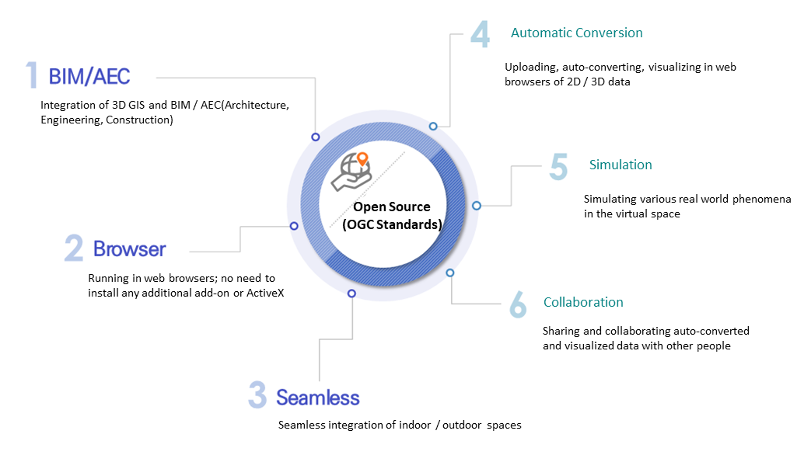
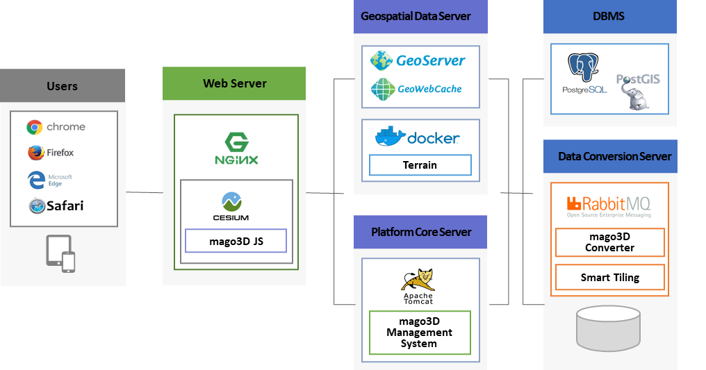
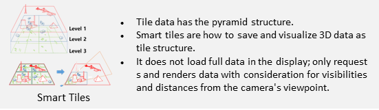

# mago3D Documentations Repository

Repository for mago3D documents. 

# Table of Contents

1. [Introduction of mago3D](#Introduction-of-mago3D)
2. [Utilization Guide of mago3D](#Utilization-Guide-of-mago3D)
3. [Domain(Terminology)](#DomainTerminology)

## Introduction of mago3D 

### **1. Definition of mago3D**

> mago3D is a digital twin platform in which users can upload, auto-convert, visualize in web browsers, share and collaborate the super large 3D BIM/AEC/GIS data; simulate various real world phenomena in the virtual space.

### **2. Features of mago3D** 

- Seamless integration of indoor / outdoor spaces on 3D GIS environments
- Running in web browsers; no need to install any additional add-on or ActiveX
- Developing based on Open Sources; guaranteed developability and expandability
- Efficient managements and super fast renderings of super large 3D files

### **3. Architecture of mago3D**

### **4. Components of mago3D**

- **mago3d** [GitHub - Gaia3D/mago3d: the latest version of mago3D](https://github.com/Gaia3D/mago3d) 
- **mago3d-js** [GitHub - Gaia3D/mago3djs: 3D Rendering Library](https://github.com/Gaia3D/mago3djs) 
- **mago3d-converter** [GitHub - Gaia3D/NewF4DConverter](https://github.com/Gaia3D/NewF4DConverter) 
- **mago3d-tiler** [GitHub - Gaia3D/SmartTiler](https://github.com/Gaia3D/SmartTiler) 

 

| **Components**       | **Description**                                                     |
| :------------------- | :----------------------------------------------------------- |
| **mago3d**           | mago3d Platform * User/Admin System Structure * Data Auto-Conversion (3D/2D) * Rule-Based Management System * Smart Tiling * Simulation * Management Features: Dashboard, User, Role, Menu, etc. * System Configuration * Per-User Configuration |
| **mago3d-js**        | Open Source Javascript Library for Visualizing 3D Multi-View Blocks  |
| **mago3d-converter** | * Converting 3D formats(IFC, 3DS, OBJ, DAE, JT) to F4D, the mago3D dedicated format * Running data size reduction and preprocessing while converting  |
| **mago3d-tiler**     | * Tiling F4D to shape smart tiles usable in mago3d platform * Not loading full data in the display; Only requesting and rendering data with consideration for visibilities and distances from the camera's viewpoint  |

## Utilization Guide of mago3D

### [Installation Guide of mago3D](./installation_guide.md)

  * [Windows](./windows_installation.md)
  * [CentOS](./linux_installation.md)

### [Developer Guide of mago3D](./developer_guide.md)

0. [Architectures and Components of mago3D](./developer_guide.md#0-Architectures-and-Components-of-mago3D)
1. [Setup a Development Environment](./developer_guide.md#1-Setup-a-Development-Environment)
2. [Components of the Project](./developer_guide.md#2-Components-of-the-Project)
3. [Relationships between DataGroup, DataInfo, and F4D](./developer_guide.md#3-Relationships-between-DataGroup-DataInfo-and-F4D)
4. [Understanding What RabbitMQ Does](./developer_guide.md#4-Understanding-What-RabbitMQ-Does)
5. [Auto-Conversion of 3D Data](./developer_guide.md#5-Auto-Conversion-of-3D-Data)
6. [Layers Management](./developer_guide.md#6-Layers-Management)
7. [Permissions Management](./developer_guide.md#7-Permissions-Management)
8. [Update of Static Contents](./developer_guide.md#8-Update-of-Static-Contents)
9. [Encryption](./developer_guide.md#9-Encryption)
10. [Memory Cache](./developer_guide.md#10-Memory-Cache)
11. [Java](./developer_guide.md#11-Java)
12. [DB Protocols](./developer_guide.md#12-DB-Protocols)
13. [Code Conventions](./developer_guide.md#13-Code-Conventions)
14. [Building](./developer_guide.md#14-Building)
15. [Logging](./developer_guide.md#15-Logging)
16. [Differences between Web / WAS Server](./developer_guide.md#16-Differences-between-Web-WAS-Server)
17. [Linking and Testing of Web / WAS Server](./developer_guide.md#17-Linking-and-Testing-of-Web-WAS-Server)
18. [Tomcat Settings](./developer_guide.md#18-Tomcat-Settings)
19. [Service Registration](./developer_guide.md#19-Service-Registration)
20. [Setup a Windows Server](./developer_guide.md#20-Setup-a-Windows-Server)

### [User Guide of mago3D](./user_guide.md)

1. [Data Conversion and Visualization](./user_guide.md#1-Data-Conversion-and-Visualization)
2. [Layer Service (Admin)](./user_guide.md#2-Layer-Service-Admin)
3. [User Management (Admin)](./user_guide.md#3-User-Management-Admin)
4. [Menus (Admin)](./user_guide.md#4-Menus-Admin)
5. [Configuration (Admin)](./user_guide.md#5-Configuration-Admin)

### [Usage Guide of mago3D-js](./mago3d-js.md)

1. [Introduction](./mago3d-js.md#1-Introduction)
2. [Dependency](./mago3d-js.md#2-Dependency)
3. [Installation of Test Environment](./mago3d-js.md#3-Installation-of-Test-Environment)
4. [Getting Started](./mago3d-js.md#4-Getting-Started)
5. [Data Registration](./mago3d-js.md#5-Data-Registration)
6. [Introduction to APIs](./mago3d-js.md#6-Introduction-to-APIs)
7. [Events Handling](./mago3d-js.md#7-Events-Handling)

## Domain(Terminology)

|    **Terminology**    | **Description**                                              |
| :-------------------: | :----------------------------------------------------------- |
|      **Data**       | * 3D model data   * Including buildings, facilities, etc. * Introducing data group concept for controlling a number of data together |
|      **Layer**       | * 2D image data * Including background maps, satellite imageries / aerophotos, various thematic maps (cadastral maps), etc. * Introducing data group concept for controlling related layers together |
| **Data Library** | * Meaning 3D data to simulate * 3D data used as libraries, such as roadside trees, streetlights, bridges, etc. * Can be placed as points or lines |
|   **Design Layer**   | * Meaning 2D data to simulate * Can reflects the extrusion (height property) of 2D data |
|    **Smart Tiles**    | * Smart tiling for optimizing 3D visualization performance * Have the pyramid structure * Are how to save and visualize 3D data as tile structure * Not loading full data in the display; Only requesting and rendering data with consideration for visibilities and distances from the camera's viewpoint |

