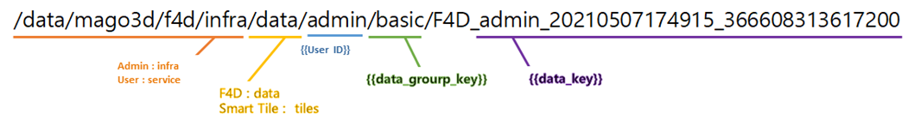
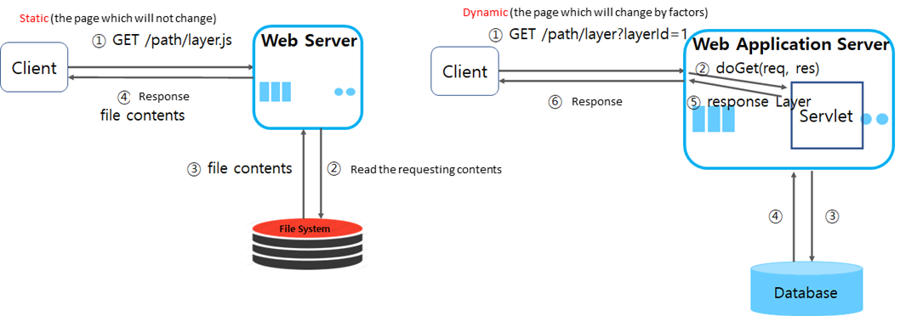

# Table of Contents

0. [Architectures and Components of mago3D](#0-Architectures-and-Components-of-mago3D)
1. [Setup a Development Environment](#1-Setup-a-Development-Environment)
2. [Components of the Project](#2-Components-of-the-Project)
3. [Relationships between DataGroup, DataInfo, and F4D](#3-Relationships-between-DataGroup-DataInfo-and-F4D)
4. [Understanding What RabbitMQ Does](#4-Understanding-What-RabbitMQ-Does)
5. [Auto-Conversion of 3D Data](#5-Auto-Conversion-of-3D-Data)
6. [Layers Management](#6-Layers-Management)
7. [Permissions Management](#7-Permissions-Management)
8. [Update of Static Contents](#8-Update-of-Static-Contents)
9. [Encryption](#9-Encryption)
10. [Memory Cache](#10-Memory-Cache)
11. [Java](#11-Java)
12. [DB Protocols](#12-DB-Protocols)
13. [Code Conventions](#13-Code-Conventions)
14. [Building](#14-Building)
15. [Logging](#15-Logging)
16. [Differences between Web / WAS Server](#16-Differences-between-Web-WAS-Server)
17. [Linking and Testing of Web / WAS Server](#17-Linking-and-Testing-of-Web-WAS-Server)
18. [Tomcat Settings](#18-Tomcat-Settings)
19. [Service Registration](#19-Service-Registration)
20. [Setup a Windows Server](#20-Setup-a-Windows-Server)


## 0. [Architectures and Components of mago3D](./README.md) 

## 1. Setup a Development Environment

- Install Java
- If you setup a development environment with docker-compose, skip setting GeoServer, database, and RabbitMQ.
- If you setup a development environment in IntelliJ, you should run it with bootRun or set Working directory as **$MODULE_WORKING_DIR$** in configuration because it sets Resource path as file path for updating static resources without building.
- [Installation Guide](./installation_guide.md)


## 2. Components of the Project

| **Project Name**    | **Description**                                              |
| :------------------ | :----------------------------------------------------------- |
| common              | Manages the common functions such as encryption (security), statistics modules, etc.                     |
| doc                 | Manages Database (ddl, dml, ...), GeoServer documents, Docker (dockerfile, ...), project documents |
| html                | Manages html design files                                      |
| mago3d-admin        | Platform (mago3D) Admin                                        |
| mago3d-user         | 2D/3D spatial data lookup, simulation linking, etc.            |
| mago3d-converter    | Manages the automations of 3D spatial information              |
| mago3d-tiler        | Manages the automations of smart tiles                         |
| mago3d-sensorthings | Manages the automations of sensor data                         |


## 3. Relationships between DataGroup, DataInfo, and F4D

###  Setup file of the path

/src/resources/mago3d.properties

### Default path

| **Path**  | **Admin **  | **User**      |
| :-------- | :---------- | :------------ |
| F4D       | /infra/data | /service/data |
| SmartTile | /infra/tile | /service/tile |

- For the data registered as admin, the default path is **infra/data**, 
- For the data registered as user, the default path is **service/data**.
- Basically both admin / user have the default group **basic**,
- The converted F4D is saved in the path **default path/user_id/data_group_key/**.

### Save path of F4D data (Full)



### Save path of F4D data (Detailed)


 

## 4. Understanding What RabbitMQ Does

###   **RabbitMQ**

[RabbitMQ](https://www.rabbitmq.com/) is a message broker system which implements [AMQP](https://ko.wikipedia.org/wiki/AMQP) with Erlang.

### AMQP(Advanced Message Queuing Protocol)

- **Messaging protocol** which enables clients to communicate with a message middleware broker.
- The important concepts of RabbitMQ are **Producer, Consumer, Queue, Exchange, Binding**.

| **항목**     | **설명**                                                     |
| :----------- | :----------------------------------------------------------- |
| **Producer** | * Is the principal agent which creates and sends messages.<br />* Note: Producer does not directly access the queue; it always access the queue through the exchange. |
| **Exchange** | * Is the object that decides which queues receive the messages sent by producers<br />* There are 4 types of exchange and its concept is a kind of a router. |
| **Binding**  | * Is an action that specify the rules of routing messages to the exchange.<br />* You can set the specific message that meets the specific conditions to be sent to specific queue; it should be set in accordance with the types of the exchange. <br />* Exchange and Queue can be M:N binded. |
| **Queue**    | * Is a space where the messages sent by producers are saved before the consumers consume them.<br />* Queues are identified by their names; if you create a queue with the same name and settings of an existing queue then it connects to the existing queue without errors; but if you try creating a queue with the same name of an existing one but different settings, an error will occur. |
| **Consumer** | * Is the principal agent which receives the messages.<br />* Consumer directly access the queue and take the messages. |


- The **producer**, which sends the messages, delivers the messages (**routing key**) to **exchange** of **broker**, then the messages are copied into linked **queue** by **binding** rules.
- The **consumer**, which receives the messages, takes and handles the messages through **queue** of **broker**.


- There are 4 types of exchange; The characteristics of each type is as follows:

| **Type** | **Description** | **Characteristics** |
| :------- | :-------------- | :------------------ |
|          |                 |                     |

| **Type**    | **Description**                                                     | **Characteristics**  |
| :---------- | :------------------------------------------------------------------ | :------------------- |
| **Direct**  | Sends the message to the queue with which the routing key **matches exactly**.        | Unicast   |
| **Topic**   | Sends the message to the queue with which the routing key **pattern matches**.          | Multicast |
| **Headers** | Sends the message to the matched queue based on the header value consisted of **[ key - value ]** | Multicast |
| **Fanout**  | Sends the message to **ALL** queues registered at corresponding exchange.          | Broadcast |

### Other Settings

- durability
  - whether it stays on or not when the broker is restarted.
  - durable : it stays on when restarted.
  - transient : it disappears when restarted.
-  auto-delete
  - it is deleted when the last queue connection is disconnected.


## 5. Auto-Conversion of 3D Data

### Flow Chart


 

 Upload data

 Register the message queue and response the status

 Auto-conversion API (mago3d-converter), while monitoring the queue of RabbitMQ, requests conversion from F4DConverter if the queue receives a message.

 When the conversion is complete at F4DConverter, a response is sent to Auto-conversion API (mago3d-converter),

and the API that received the response collects the conversion results (logs, attributes, locations).

 

Create attributes file or location file only when there is corresponding information

Location file : `lonsLats.json` under the converted F4D directory

Attributes file : `attributes.json` under the converted F4D directory

 

Always create log file

Log file : `ConverterServiceImpl`, `executeConverter`

 

 Update data conversion results 


## 6. Layers Management 

- Only admin can register, modify, and delete layers; user can only visualize layers registered by admin.
- Vector 
  - Now, only shapefiles can be uploaded.
  - Shapefiles are registered using ogr2ogr; registering is GDAL dependent. 
- 
- Raster 
  - Raster data is mostly very large so admin does not upload data by data; admin registers data in the storage to GeoServer then manages them. 
  - Admin can set a layer registered at GeoServer as service object; can use not only WMS but GeoWebCache too by setting whether or not using cache.
- 


## 7. Permissions Management

All users belong to their own group; and the group decides which menus and permissions are accessible.


## 8. Update of Static Contents

- 

- A browser caches the static contents such as CSS, JavaScript, etc.; they are reflected only when new contents deletes browser cache.

- You can attach a timestamp query string like `?version=20201202123453` to a content path but in this case the query requests not cached content but a new contnet even if there is not a change in the content.

- To update cache only if there are some changes in the content, attach **cacheVersion** to a path as follows; then the cached content will be updated only if necessary.

  ```
  <script type="text/javascript" th:src="@{/js/{lang}/layer.js(lang=${lang},cacheVersion=${contentCacheVersion})}"></script>
  ```

## 9. Encryption 

1) Encrypt JDBC connection and various account information

   –  Uses SEED encryption algorithm (a block cipher algorithm using 128 bits cryptographic keys).
   –  Uses a 16 bytes key; **the key should be different for all projects**. If you make a same key for more than two projects, then someone who has one key can also decrypt other projects.

   – For encryption / decryption of DB connection information of application.properties, runs a CryptTest from gaia3d.security package of the common project. 


2) Encrypt user password for log-in 

​    – For encryption of user information, runs `bCryptPasswordEncoderTest` from PasswordTest of gaia3d.utils package of mago3d-admin project.

​    – After encryption, saves information using `BCryptPasswordEncoder` of Spring Security. 
​    – **Note: When setting strength of BCryptPasswordEncoder 10 or more, it will decline the performance**.


## 10. Memory Cache

- Uses memory cache for policy, geopolicy, userGroup, menu, role.

- **User application should be up and running when updates the above items**, because the admin sends any change to user application if there is any change to them.

- **User application should be restarted if you update memory cache manually while the application is running, because DB took the above information and cached them in the memory when the application started**.


## 11. Java

- **Package**

– api : API for the external use. Inherits and uses APIController if there shold be log records.

– controller

– rest : RestController

– view : Controller

– interceptor : Various interceptors related to locale, login, etc. ConfigInterceptor : Binds information (menus, contentVersion, etc.) to use in the view.

- **resources**

– develop : Setup file for the development server

– messages : Message properties for multilingual processing

– static

– externlib : External library

- logback.xml : For viewing the detailed logs

```
logger name="org.springframework" 값을 "org.springframework.web" 으로 변경
```

- **Syntax**
– Transaction Management : Separates reading, writing, modifying, and deleting. @Transactional, @Transactional(read-only)

– In case of a single transaction, when controller calls a service class, the service should not be called multiple times. When the logic is complex, the service class separates it into private methods, etc.

– In case of service class exceptions handling, when it is in a try / catch clause, converts it into RuntimeException and throws; when they are other exceptions, explicitly uses rollback-for; because spring only rollbacks runtimeException. For example: bulletin board lists, bulletin board details, attached files.

– Uses enum for code values, includes enum used in each domain within a domain, separates into files for common enum. Under developing.

– Uses LocalDateTime rather than Calendar / Date for dates related contents.

– For the result values of API and/or JSON Response, LocalDateTime vlues are not displayed properly. Being bypassed using viewInsertDate. Will be improved later.

– Uses stream for foreach; be aware of using codes which reduces performances.

– Shares server-to-server sessions using HA Tomcat Clustering; implements Serializable for the network communications data.

– For multilingual processing, server messages are written in message.properties file; client messages in message.js file. If server can not handle messages, links with message.js using JSON id. 

- Security

  - Does not apply Spring Security. Will apply later because Role expansion is limited.
  - For SQL Injection, will apply OWASP Antisamic which uses XSSFilter or NHN Lucy.

- Spring Boot

  - Runnable JAR is easy for developing, but there are issues with changing client's setups (paths, IPs) and duplicating; All will be changed into WARs later.


## 12. DB Protocols

- Uses tablename_id for the column name that is the primary key.

- For development convenience, applies foreign key before the operation.

- Uses partitions if the number of data is super large (data counts over millions in the span of 30 years) **For PostgreSQL 12, will be applied when "enable_partition_pruning = on" is set**.

- In the span of 30 years, uses BigInt for data of over a billion counts (long type)

- For statistics data, allows duplicate columns for optimization. Years, Months, Days, Weeks are duplicate with insert_date, but pre-calculates and saves them.

- Uses Lambda Architecture if there is an issue in which statistics data should be displayed in real time.

- For longitudes and latitudes, saves as Geometry(POINT, 4326); for heights, saves as Numeric type(Altitude).

- Uses timestamp with time zone for Time type.

  


## 13. Code Conventions

- **java**
  – You should use `LogMessageSupport.printMessage(exception);` if you want to output e.printStackTrace.

  - In case of permissions for each function, you write them considering roleValidator of the Controller.
  - Run `SQLInjectSupport.replaceSqlInection` first at the page where form tag is sent to. (Security Audit)

  - We had thrown ResponseEntity for the return value of Rest API (Http API) or Ajax communications, but there are difficulties for exception handlings, etc. on the clients side; we changed it to map itself having a fixed key value.

- **FrontEnd**

  – Thymeleaf Code Conventions : [Thymeleaf Type](https://gaia3d.atlassian.net/wiki/spaces/project/pages/32309256) 

  – handlebar.js **:** Using Thymeleaf makes server and view strongly combined so we do not use it; Use it for rendering dynamic contents. ([handlebar.js Rules](https://gaia3d.atlassian.net/wiki/spaces/project/pages/28049409) )

  - Web accessibility compliance
  - Separate folders for multilingual processing
  - In admin and user pages, do not use a JavaScript or CSS file of the same name at the same time. Cached data will reside.

- **mybatis** 

– Use capital letters for the reserved words. Write `/* sql Id you are calling */` at the first line of SQL.

– Write as the following order: SELECT, INSERT, UPDATE, DELETE

– Do not use map in parameterType and resultType. Use default alias for int, long, string, etc.

– Comply the following indentation rules at all times.

```
UPDATE table 
SET
  column = ${value};
  
INSERT INTO table (
  column1, column2.....
) VALUES (
  value1, value2...
)

SELECT 
  column
FROM
WHERE
ORDER BY
```


## 14. Building 

- mago3d project now uses Gradle v6.5.0. When building, you can use separately installed Gradle or Gradle wrapper embedded in the project.

- Run the following commands in the root folder if you build the whole project or in the specific project folder if you build the corresponding project.

  ```
  gradlew clean
  gradlew build
  ```

- In default properties settings we use resource path as file path so if you want to run the application in Servlet container, you should use classpath.

- It is not realistic that you change properties settings whenever you deploy the applications. It makes sense that you make separate properties files and, when building, you can use profile option and build with corresponding properties file.

- When building with develop:

  ```
  gradlew build -Pprofile=develop
  ```

- If the build succeeds, WAR or JAR file is created in `project path/build/libs` according to build.gradle settings.

- WAR vs. JAR

  - When building JAR, Tomcat embedded in Spring Boot can start the application quite easily. But in this case you can not change properties settings; it can be very inconvenient if you have to supply to many clients and should have different properties settings for each.
  - When building WAR, a separate Servlet Container (Tomcat, Jetty, JBoss, etc.) for the application is required.


## 15. Logging 

- Manages at `resources/logback-spring.xml`.

- Uses ConsoleAppender in the local development environments; level of the logging is debug.

- If errors occur while developing and you need more details, modify org.springframework logger as the following.

  ```
  <logger name="org.springframework.web" level="info" additivity="false" />
  ```

- You can have debug level in local environments. However if you use debug level in operation environments there are too many logs and the logging even reduces the performance. You should use info level in operation environments.

- In the local environments we use ConsoleAppender, however, in operation environments we need to manage logs as files so we use FileAppender instead.


## 16. Differences between Web / WAS Server

- Web Server 

  - Receives HTTP requests from web browser clients and services **static contents** such as HTML, JavaScript, etc.
  - Apache, IIS, Nginx, ...

- WAS Server 

  - This Application Server is created for servicing **dynamic contents** those requires processing of DB lookup or various logics.

  - This server runs the application in computers or devices via HTTP.

  - Tomcat, WebSphere, JBoss, ...

    

- Why we separate Web Server from WAS Server?

  - WAS Server takes a lot of load for processing DB lookup or various logics. Simple static contents should be serviced to the clients by Web Server. If WAS Server handles both dynamic and static contents, the load it takes increases and dynamic contents processings are delayed and the performance will slow down.
  - If they are separated physically, it insures security.
  - It is better for load balancing, fail over handling, etc.


## 17. Linking and Testing of Web / WAS Server

- Apache & Tomcat 
  - mod_jk (recommended)
    - A flexible setup of per-URL or per-contents is possible when using JKMount option.
    - It is hard to setup.
    - Tomcat only
  - mod_proxy, mod_proxy_ajp
    - No need to install extra modules; it is easy to setup.
    - Not dependent to specific WAS.
    - A flexible setup of per-URL is hard.
- Nginx & Tomcat
  - Linking is possible by adding proxy settings to `location` of Nginx Configuration file.
- Test 
  - Check access_log files of Web / WAS servers, accessing specific URL of the application deployed at WAS.
  - 


## 18. Tomcat Settings

- According to the settings in server.xml, the service is possible when placing the application under `webapps` of Tomcat path or other specific path.
  - appBase : Virtual host directory (webapps) where the application would be run.
  - docBase : Specify other directory where the application would be run.
- When using docBase, do not use a sub path of webapps as the path of the application. Sometimes it conflicts with logback settings, etc. when mago3D application starts.
- In Linux environment, the size of catalina.out file increases without limit; You should set to not use catalina.out file in catalina.sh file; or set `log rotate`.
- You can use JVM related options in setenv.sh (Linux), setenv.bat (Windows).
  - When registering services in Windows environment, the options set in setenv.bat file do not apply so in this case you should set the options in service.bat file.


## 19. Service Registration

- Tomcat
  - Services can be registered using service.bat file in tomcat folder.
- nginx.exe & mago3d-converter.jar
  - Services can be registered with WinSW (Windows Service Wrapper) program.


## 20. Setup a Windows Server

- Install Java and set environment variables
- Install PostgreSQL
  - Use port 5432
  - **JDBC URL of mago3d admin / user has the port 15432, You should change it according to PostgreSQL port when deploying**
- Install GDAL and set environment variables
- Install RabbitMQ and set environment variables
- Install f4d converter
- Deploy GeoServer in Tomcat and register Tomcat as Windows service
  - Set geoserver_data_dir as a separate path
  - Set min. / max. of JVM memory size as 4 gigabytes
- Deploy mago3d-admin / mago3d-user as separate services in same Tomcat and register Tomcat as Windows service
  - Set min. / max. of JVM memory size as 4 gigabytes
  - Set admin / user logging as file
- Register Nginx as Windows service, link it with mago3d Tomcat server, and set Nginx to handle static contents
- Register mago3d-converter.jar as Windows service
  - Set logging as file
- Test
  - Register 2D Administrative Division layer on mago3d-admin
  - Auto-convert and visualize 3D layer on mago3d-user
