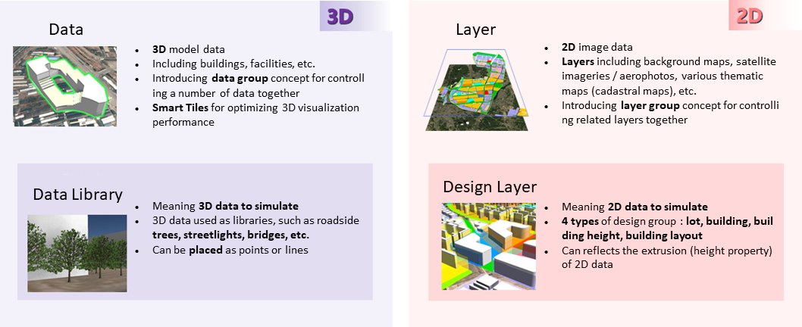

## Domain(Terminology)
|    **Terminology**    | **Description**                                              |
| :-------------------: | :----------------------------------------------------------- |
|      **Data**       | * 3D model data   * Including buildings, facilities, etc. * Introducing data group concept for controlling a number of data together |
|      **Layer**       | * 2D image data * Including background maps, satellite imageries / aerophotos, various thematic maps (cadastral maps), etc. * Introducing data group concept for controlling related layers together |
| **Data Library** | * Meaning 3D data to simulate * 3D data used as libraries, such as roadside trees, streetlights, bridges, etc. * Can be placed as points or lines |
|   **Design Layer**   | * Meaning 2D data to simulate * Can reflects the extrusion (height property) of 2D data |
|    **Smart Tiles**    | * Smart tiling for optimizing 3D visualization performance * Have the pyramid structure * Are how to save and visualize 3D data as tile structure * Not loading full data in the display; Only requesting and rendering data with consideration for visibilities and distances from the camera's viewpoint |

