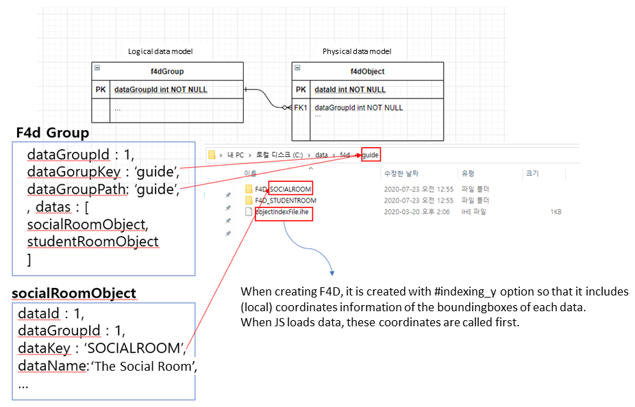

# Table of Contents

1. [Introduction](#1-Introduction)
2. [Dependency](#2-dependency)
3. [Installation of Test Environment](#3-Installation-of-Test-Environment)
4. [Getting Started](#4-Getting_Started)
5. [Data Registration](#5-Data-Registration)
6. [Introduction to APIs](#6-Introduction-to-APIs)
7. [Events Handling](#7-Events-Handling)


## 1. Introduction

- **mago3d JS is a JavaScript library to process and display various 3D data on the globe.**


## 2. Dependency 

- mago3D JS requires CesiumJS by default. By inserting codes into rendering pipeline of CesiumJS, mago3D JS renders F4D data and runs various functions. Because of this, mago3D JS is distributed with modified CesiumJS.

- When using mago3D JS, you can use the all functions supported by CesiumJS. (The functions you can use will be different according to imported cesium.js versions.)


- Thus you should import and use the attached cesium.js when using mago3D JS.

```
<link rel="stylesheet" href="./cesium/Widgets/widgets.css" />
<script src="./cesium/Cesium.js"></script>
```


## 3. Installation of Test Environment

[The GitHub page of mago3D JS (refer to the installation processes)](https://github.com/Gaia3D/mago3djs)

- The installation processes : **4, 5(some of them), 6(skip)**

- Additional works
  - Change the branch to feature/3.0 (git clone -b feature/v3.0 --single-branch https://github.com/Gaia3D/mago3djs.git)
  - [Download sample F4D file](https://gaia3d-my.sharepoint.com/personal/jhkwun_gaia3d_com/Documents/mago3djs_guide_f4d/guide.zip)
  - (The last part of 5) Link the folder that will service F4D. (mklink /d "mago3djs repository path"\f4d "data path"       ex : mklink /d D:\repository\mago3djs\f4d D:\data\f4d)
  - [Test page](http://localhost/sample/guide.html)


## 4. Getting Started

```

		/**
		 * @param {Stirng} containerId container div id. required.
		 * @param {object} serverPolicy mage3d geopolicy. required.
		 * @param {object} callback loadstart callback, loadend callback. option.
		 * @param {object} options Cesium viewer parameter. option.
		 * @param {Cesium.Viewer} legacyViewer. When interacting with other systems there would be a occasion where a "view" object is created and passed on. option.
		*/
        var MAGO3D_INSTANCE= new Mago3D.Mago3d('magoContainer', geoPolicyJson, {loadend : magoLoadEnd}, cesiumViewerOption);
        
        function magoLoadEnd(e) {
            //When running mago3d load end callback, the same object with mago3D instance is passed on.
            var mago3d = e;
            
            //mago3d Main class
            var magoManager = mago3d.getMagoManager();
            
            //cesium Viewer object
            var viewer= mago3d.getViewer();
            
            //Use this when registering or removing F4D.
            var f4dController= mago3d.getF4dController();
        }
```

- Main items of serverPolicy

| Variable Name                              | **Description**                                              | **Required** | **Default Value**  | **Type** |
| :----------------------------------------- | :----------------------------------------------------------- | :----------- | :----------------- | :------- |
| `basicGlobe`                               | JavaScript 3D Globe. Use 'CesiumJS' by default. Can use 'magoworld' option. | Y        | `'cesium'`         | string   |
| `cesiumIonToke`                            | Use it when you have Cesium Ion Token. Ion Service is available only when Cesium Ion Token is registered. | N        |                    | string   |
| `terrainType`                              | Shape of terrain. **cesium-default** : A spherical globe without real terrain expression. **cesium-ion-default** : A default Cesium Ion terrain. Available only when Cesium Ion Token is registered. **cesium-ion-cdn** : Call and use a terrain registered to Cesium Ion. Set the corresponding assetId to terrainValue. Available only when Cesium Ion Token is used. **cesium-customer** : Set this only when an user-created Cesium terrain is used. (For example, when servicing a CTB-created terrain via CTS.) Register the terrain service URL to terrainValue. **geoserver** : Use it when servicing a terrain using geoserverTerrainProvider (Not recommended) |          | `'cesium-default'` | string   |
| `terrainValue`                             | Set the value corresponding to terrainType.                                 |          |                    | string   |
| `online`                                   | Whether or not the system has online environment.                           |          | `true`             | boolean  |
| `geoserverEnable`                          | Whether or not GeoServer service is used.                                   |          |                    | boolean  |
| `geoserverImageproviderEnable`             | Set to 'true' if the background map is serviced by GeoServer.               |          | `false`            | boolean  |
| `geoserverImageproviderUrl`                | GeoServer WMS URL example : 'http://localhost:8080/geoserver/wms'           |          |                    | string   |
| `geoserverImageproviderLayerName`          | Name of the layer to service.                                               |          |                    | string   |
| `geoserverImageproviderStyleName`          | Name of the style to apply.                                                 |          |                    | string   |
| `geoserverImageproviderParametersWidth`    | Width of the image.                                                         |          | 256                | number   |
| `geoserverImageproviderParametersHeight`   | Height of the image.                                                        |          | 256                | number   |
| `geoserverImageproviderParametersFormat`   | Format of the image.                                                        |          | ‘image/jpeg’       | string   |
| `geoserverTerrainproviderLayerName`        | If terrainType is geoserver, the name of the layer to be serviced as terrain by GeoserverTerrainProvider. |          |                    | string   |
| `geoserverTerrainproviderStyleName`        | If terrainType is geoserver, the name of the style to be applied to terrain. |          |                    | string   |
| `geoserverTerrainproviderParametersWidth`  | Width of the terrain.                                                       |          | 256                | number   |
| `geoserverTerrainproviderParametersHeight` | Height of the terrain.                                                      |          | 256                | number   |
| `geoserverTerrainproviderParametersFormat` | Format of the terrain.                                                      |          |                    | string   |
| `initCameraEnable`                         | Whether or not to use the 'move to the starting position' function when the globe gets started. |          |                    | boolean  |
| `initLatitude`                             | Latitude of the starting position.                                          |          |                    | number   |
| `initLongitud`                             | Longitude of the starting position.                                         |          |                    | number   |
| `initAltitude`                             | Altitude  of the starting position.                                         |          |                    | number   |
| `initDuration`                             | Time to move to the starting position. If 0, no animation effects.          |          |                    | number   |
| `lod0`                                     | Distance to display at lod0 level                                           |          | 15                 | number   |
| `lod1`                                     | Distance to display at lod1 level                                           |          | 60                 | number   |
| `lod2`                                     | Distance to display at lod2 level                                           |          | 90                 | number   |
| `lod3`                                     | Distance to display at lod3 level                                           |          | 200                | number   |
| `lod4`                                     | Distance to display at lod4 level                                           |          | 1000               | number   |
| `lod5`                                     | Distance to display at lod5 level                                           |          | 50000              | number   |

- Cesium Viewer 

[Cesium Viewer document page](https://cesium.com/docs/cesiumjs-ref-doc/Viewer.html) 


## 5. Data Registration



```
function magoLoadEnd(e) {
    var mago3d = e;
  
    //Use this when registering or removing F4D.
    var f4dController= mago3d.getF4dController();
    
    var f4dGroup = {
        "metainfo": {
            "isPhysical": false
        },
        "dataGroupId":1,
        "dataGroupKey":"guide",
        "dataGroupName":"guide data group",
        "dataGroupPath":"guide",
        "datas": []
    };
    
    var socialRoomObject= {
        "metainfo": {
            "isPhysical": true,
            "flipYTexCoords": true
        },
        "dataId" : 1,
        "dataGroupId" : 1,
        "dataKey": "SOCIALROOM",
        "dataName": "SOCIALROOM",
        "mappingType":"origin",
        "longitude": 128.917656,
        "latitude": 35.139482,
        "height": 14.177629,
        "heading": 0.000000,
        "pitch": 0.000000,
        "roll": 0.000000
    };
    
    f4dGroup.datas.push(socialRoomObject);
    
    f4dController.addF4dGroup(f4dGroup);
}
```

**f4dGroup**

F4D data group.

##### Type:

- Object

##### Properties:

| Name            | Type              | Description                                                 |
| :-------------- | :---------------- | :---------------------------------------------------------- |
| `dataGroupId`   | string            | Required. Unique ID of F4D layer.                           |
| `dataGroupKey`  | string            | Required. Match key for layer folder.                       |
| `dataGroupName` | string            | Required. Name of layer.                                    |
| `dataGroupPath` | string            | Required. Path of layer folder.                             |
| `tiling`        | boolean           | Optional. Whether or not there is tiling.                   |
| `datas`         | Array.<f4dObject> | Optional. List of F4Ds included in the corresponding layer. |
| `longitude`     | number            | Optional. Longitude representing data group.                |
| `latitude`      | number            | Optional. Latitude representing data group.                 |
| `altitude`      | number            | Optional. Altitude representing data group.                 |
| `metainfo`      | object            | Attributes.                                                 |

**f4dObject**

F4D data object.

##### Type:

- Object

##### Properties:

| Name          | Type   | Description                                                                                        |
| :------------ | :----- | :------------------------------------------------------------------------------------------------- |
| `dataId`      | string | Required. Unique ID of data.                                                                       |
| `dataGroupId` | string | Required. Layer ID of data.                                                                        |
| `dataKey`     | string | Required. Name of the data folder.                                                                 |
| `dataName`    | string | Required. Name of data.                                                                            |
| `dataType`    | string | Optional. Type of data.                                                                            |
| `mappingType` | string | Optional. Case 'origin', 'boundingboxcenter', 'boudingboxbottomcenter'. Default value is 'origin'. |
| `longitude`   | number | Required. Longitude.                                                                               |
| `latitude`    | number | Required. Latitude.                                                                                |
| `altitude`    | number | Optional. Altitude. It does not matter if it is a number. Default value is 0.                      |
| `heading`     | number | Optional. Heading. Default value is 0.                                                             |
| `pitch`       | number | Optional. Pitch. Default value is 0.                                                               |
| `roll`        | number | Optional. Roll. Default value is 0.                                                                |
| `metainfo`    | object | Required. 'true' value must be matched with isPhysical key. Example : {isPhysical : true}          |

 
## 6. Introduction to APIs

- changeBoundingBoxAPI(`MAGO3D_INSTANCE`, isShow);
- changeLabelAPI(`MAGO3D_INSTANCE`, isShow);
- changeObjectMoveAPI(`MAGO3D_INSTANCE`, “0“);
- gotoFlyAPI(`MAGO3D_INSTANCE`, longitude, latitude, altitude , duration);
- searchDataAPI(`MAGO3D_INSTANCE`, dataGroupId , dataKey);


## 7. Events Handling 

```
function loadend(e) {
        console.info('Complete construct mago3d instance. Enjoy!');
        
        var magoInstance = e;
        var magoManager = magoInstance.getMagoManager();
        
        var f4dController = magoInstance.getF4dController();
        
        var f4dGroup = ...

        var socialRoomObject = ...
        f4dGroup.datas.push(socialRoomObject);
        f4dController.addF4dGroup(f4dGroup);

        magoManager.once(Mago3D.MagoManager.EVENT_TYPE.SELECTEDF4D, function(e) {
            console.log('selected f4d event once trigger');
            var studentRoomObject= {
                "metainfo": {
                    "isPhysical": true,
                    "flipYTexCoords": true
                },
                "dataId" : 1,
                "dataGroupId" : 1,
                "children": [],
                "dataKey": "STUDENTROOM",
                "dataName": "STUDENTROOM",
                "mappingType":"origin",
                "longitude": 128.919656,
                "latitude": 35.138482,
                "height": 14.177629,
                "heading": 0.000000,
                "pitch": 0.000000,
                "roll": 0.000000
            }
            f4dController.addF4dMember(1, studentRoomObject);       
        });
        magoManager.on(Mago3D.MagoManager.EVENT_TYPE.F4DLOADEND, function(e){
            console.info(e.f4d.length + 'counts of data is loaded.');
        });
    }
```

- List of events

  `'CLICK'`

  `'DBCLICK'`

  `'RIGHTCLICK'`

  `'MOUSEMOVE'`

  `'LEFTDOWN' `

  `'LEFTUP' `

  `'F4DLOADSTART'`

  `'F4DLOADEND' `

  `'F4DRENDERREADY'`

  `'SELECTEDF4D'`

  `'SELECTEDF4DMOVED'`

  `'SELECTEDF4DOBJECT'`

  `'SELECTEDGENERALOBJECT'`

  `'DESELECTEDF4D'`

  `'DESELECTEDF4DOBJECT'`

  `'DESELECTEDGENERALOBJECT'`

  `'CAMERACHANGED'`

  `'CAMERAMOVEEND'`

  `'CAMERAMOVESTART'`

