# 목차 
1. [Java](#1-java)
2. [PostgreSQL and PostGIS](#2-postgresql-and-postgis)
3. [GDAL](#3-gdal)
4. [GeoServer](#4-geoserver)
5. [F4D Converter](#5-f4d-converter)
6. [RabbitMQ](#6-rabbitmq)
7. [Default Table Creation and Password Update](#7-default-table-creation-and-password-update)
8. [Setup](#8-setup)
9. [Layer Upload Test](#9-layer-upload-test)
10. [3D Data Upload Test](#10-3d-data-upload-test)

## 1. Java
### 1) Installing Java

- Download the file corresponding to your development environments at Java Installation homepage (https://jdk.java.net/archive/).
- Unzip the downloaded file to the installation folder.

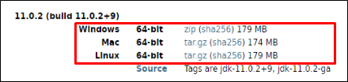


### 2) Setting Java environment variables

- [Control Panel] → [System and Security] → [System] or right-click [My Computer] and choose [Properties] then click [Advanced System Properties].

- In the [System Properties] window, click the [Advanced] tab, then click the [Environment Variables] button.

- In the [Environment Variables] window, click the [New...] button and enter **JAVA_HOME** for a variable name and Java installation path for variable value.

- After setting Java installation path, choose **[Path] variable out of system variables** and click the [Edit...] button.

- Enter and save **%JAVA_HOME%\bin;** at the frontmost position.


 

### 3) Checking Java installation

- Open the command prompt and run the following command.

```
java -version
```

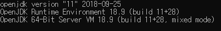


## 2. PostgreSQL and PostGIS
### 1) Installing PostgreSQL

- Download the installation file for Windows from PostgreSQL homepage (https://www.postgresql.org/). (https://www.enterprisedb.com/downloads/postgres-postgresql-downloads)

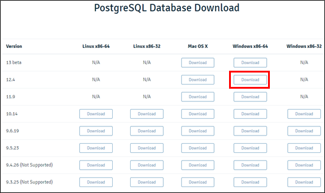

- Run the downloaded file to install PostgreSQL.

- Click [Folder] button and enter the installation path.

- Uncheck [Stack Builder] from the installation list.

- Enter "postgres" for Password and Retype password.

- Set port (5432) and locale (Korea).


 
### 2) Installing PostGIS

- To install PostGIS, (a) install it using Stack Builder after having installed PostgreSQL (b) run the installer. Here we do (b) because installation with Stack Builder often causes some errors. Installation with installer is safer considering the non-internet environments. ([http://download.osgeo.org/postgis/windows/pg12/](http://download.osgeo.org/postgis/windows/pg11/))

- Here we download [postgis-bundle-pg12x64-setup-3.0.2-1.exe](http://download.osgeo.org/postgis/windows/pg12/postgis-bundle-pg12x64-setup-3.0.2-1.exe) version.

- When the download is finished, you can proceed to install PostGIS.


### 3) Setting PostgreSQL

- Uncomment "enable_partition_pruning = on" in postgresql.conf file for the partitions setup.

- In Windows, postgresql.conf file is at **C:\Program Files\PostgreSQL\12\data** path if you installed with default options. You need to restart PostgreSQL service after editing the configuration file.

  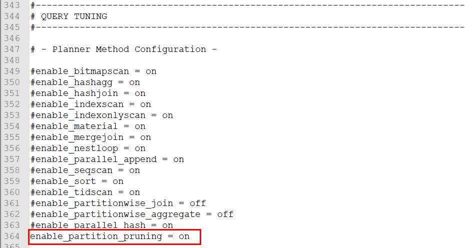
   

### 4) Creating database

- Create a new DB as follows after connecting with PostgreSQL using psql or PgAdmin.

  ```
  CREATE DATABASE mago3d
  WITH OWNER = postgres
       ENCODING = 'UTF8'
       TEMPLATE = template0
       TABLESPACE = pg_default
       LC_COLLATE = 'C'
       LC_CTYPE = 'C'
       CONNECTION LIMIT = -1;
  ```

### 5) Enabling PostGIS

- Run the following SQL after connecting with the created DB using psql or PgAdmin.

  ```
  CREATE EXTENSION postgis;
  ```

- Check PostGIS installation
  ```
  SELECT postgis_version();
  ```


## 3. GDAL
### 1) Installing GDAL

- The reason we install GDAL is to use "ogr2ogr" when we insert Shapefiles into DB. You may install GDAL as standalone, or set GDAL path by installing QGIS.

- Go to GDAL homepage (https://trac.osgeo.org/osgeo4w/).

- Download the corresponding file from [64bit].

  )

- Run the downloaded file. A installation window appears.

- Beside GDAL, you may check QGIS / GRASS GIS if you need.


### 2) Setting GDAL environment variables

- [Control Panel] → [System and Security] → [System] or right-click [My Computer] and choose [Properties] then click [Advanced System Properties].

- In the [System Properties] window, click the [Advanced] tab, then click the [Environment Variables] button.

- Select **[Path] variable out of user variables** and click [Edit...] button.

- Click [New...] button and add **C:\OSGeo4W64\bin;**.

- **If you also installed QGIS, add qgis\bin path**.

### 3) Checking GDAL installation

- Check whether or not "ogr2ogr" is properly registered as an environment variable by opening the command prompt and running the following command.

  ```
  ogr2ogr
  ```

  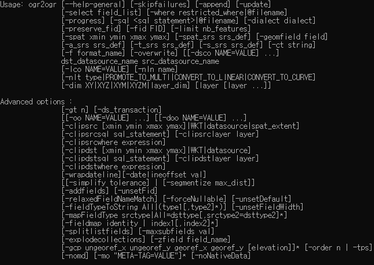

- **If WAS is running after registering environment variables, beware that the registered environment variables will be only applied when WAS is restarted; command prompt, too. After registering environment variables, you need to check in the new command prompt.**


## 4. GeoServer
### 1) Installing GeoServer 설치

- Download Web Archive version at GeoServer homepage (http://geoserver.org/release/maintain/) to service GeoServer as WAR on Tomcat.
- Unzip the downloaded file, then unzip geoserver.war file to `webapp` folder of Tomcat path.

### 2) WPS Extensions

- Download plugins corresponding to GeoServer version.

https://sourceforge.net/projects/geoserver/files/GeoServer/2.16.4/extensions/geoserver-2.16.4-wps-plugin.zip/download

- gs-web-wps-2.16.4.jar

- gs-wps-core-2.16.4.jar

- gs-process-geometry-22.4.jar

- gt-xsd-wps-22.4.jar

- net.opengis.wps-22.4.jar

- serializer-2.7.2.jar

- Unzip them, and copy and paste `.jar` files to `WEB-INF/lib` folder of GeoServer path.

- Check if WPS exists in service items after restarting GeoServer.

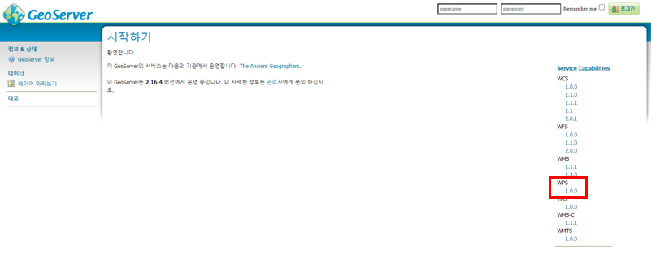


### 3) OpenGXT + GeoTools Extentions

- Download plugins corresponding to GeoServer version.

https://sourceforge.net/projects/mango-spatialstatistics/files/GeoServer/

- gs-wps-spatialstatistics-2.16-SNAPSHOT.jar

- gt-process-spatialstatistics-22-SNAPSHOT.jar

- Unzip them, and copy and paste `.jar` files to `WEB-INF/lib` folder of GeoServer path.

- Check if WPS process is bound after restarting GeoServer.GeoServer.

- [GeoServer Administration Page] → [Demo] → [WPS Request Builder]

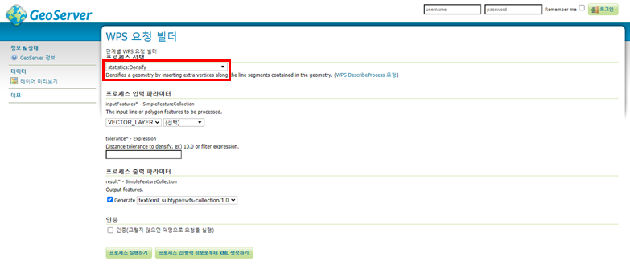


### 4) Setting CORS

- Configure as follows in web.xml file of Tomcat.

  ```
  <filter>
      <filter-name>CorsFilter</filter-name>
      <filter-class>org.apache.catalina.filters.CorsFilter</filter-class>
      <init-param>
          <param-name>cors.allowed.origins</param-name>
          <param-value>*</param-value>
      </init-param>
      <init-param>
          <param-name>cors.allowed.methods</param-name>
          <param-value>GET,POST,HEAD,OPTIONS,PUT</param-value>
      </init-param>
      <init-param>
          <param-name>cors.allowed.headers</param-name>
          <param-value>*</param-value>
      </init-param>
      <init-param>
          <param-name>cors.exposed.headers</param-name>
          <param-value>Access-Control-Allow-Origin,Access-Control-Allow-Credentials</param-value>
      </init-param>
      <init-param>
          <param-name>cors.preflight.maxage</param-name>
          <param-value>10</param-value>
      </init-param>
    </filter>
  ```

### 5) Creating workspace and store

- [GeoServer Administration Page] → [Data Management / Workspaces] → **[Add New Workspace]**

```
Name : mago3d
Namespace URI : http://www.gaia3d.com
Check [Default Workspace]
```

- [GeoServer Administration Page] → [Data Management / Stores] → [Add New Store] → PostGIS

- Enter the information of DB created after the installation of PostgreSQL. You must have installed PostGIS extension to the created DB, because if not you can not register PostGIS store.

  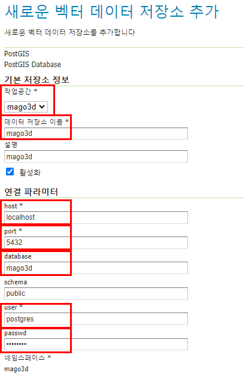


## 5. F4D Converter
- Download F4D Converter via the link below.

[F4DConverter/SetupF4DConverter.msi at master · Gaia3D/F4DConverter](https://github.com/Gaia3D/F4DConverter/tree/master/install) 

- **Installation path : C:\F4DConverterConsole**

- Run the downloaded file to install F4D Converter.

  


## 6. RabbitMQ
- RabbitMQ is an open source message broker software of AMOP (Advanced Message Queueing Protocol), the standard MQ protocol.

- RabbitMQ has an advantage of speedy processing but also has a dependency to Erlang. Thus Erlang / OTP is required before installing RabbitMQ. The versions by RabbitMQ version can be found at RabbitMQ homepage[(https://www.rabbitmq.com/which-erlang.html](https://www.rabbitmq.com/which-erlang.html)).

### 1) Installing Erlang

- Install Erlang first, since Erlang is required for RabbitMQ installation.

- Click and download 'OTP 23.0 Windows 64-bit Binary File' from [Download OTP 23.0] section of Erlang homepage (https://www.erlang.org/downloads).

  

- Run the downloaded file.

- Click [Next], because we use default configurations.

- Set the installation path as **"C:\erlang\otp_22.2\erl10.6"** to make it easy to manage the versions of Erlang.

- Click [Install] button.

- If Visual C++ components installation window appears, check the box and install it.


### 2) Installing RabbitMQ

- At RabbitMQ homepage (https://www.rabbitmq.com/download.html), check the latest version (RabbitMQ 3.8.7) and download the installer file according to your OS environment.

- Use default configurations and click [Next].

- Enter the path as **"C:\RabbitMQ\"** and click [Install].

- When the installation finishes, click [Next].

- When you confirm the installation is complete, close the window by clicking [Finish] button.
 

### 3) Setting RabbitMQ environment variables

- [Control Panel] → [System and Security] → [System] or right-click [My Computer] and choose [Properties] then click [Advanced System Properties].

- In the [System Properties] window, click the [Advanced] tab, then click the [Environment Variables] button.

- In the [Environment Variables] window, click the [New...] button and enter **RABBITMQ_HOME** for a variable name and RabbitMQ installation path for variable value.

- After setting RabbitMQ installation path, choose **[Path] variable out of system variables** and click the [Edit...] button.

- Enter and save **%JAVA_HOME%\bin;** at the frontmost position.

- Click the [New...] button and enter **%RABBITMQ_HOME%\sbin**.


### 4) Connecting RabbitMQ Administration page ([http://localhost:15672](http://localhost:15672/))

- Management plugin must be enabled for connecting RabbitMQ Administration page. (If not enabled, you can not connect to the page.)
- To enable management plugin of RabbitMQ, enter **"rabbitmq-plugins enable rabbitmq_management"** at the command prompt.
- Restart the command prompt and check if the plugin is enabled with **"rabbitmq-plugins list"** command.


### 5) Configuring RabbitMQ Admin

- Go to RabbitMQ Administration page ([http://localhost:15672](http://localhost:15672/)).

- Login ID and password are both "guest".


- Click [Exchange] tab at the topside.

- Click [Add a new exchange] at the bottomside and enter as the following screen. Click [Add exchange] button.

  - *Name : f4d.converter*
  - *Type : topic*
  - *Durability : Durable*

  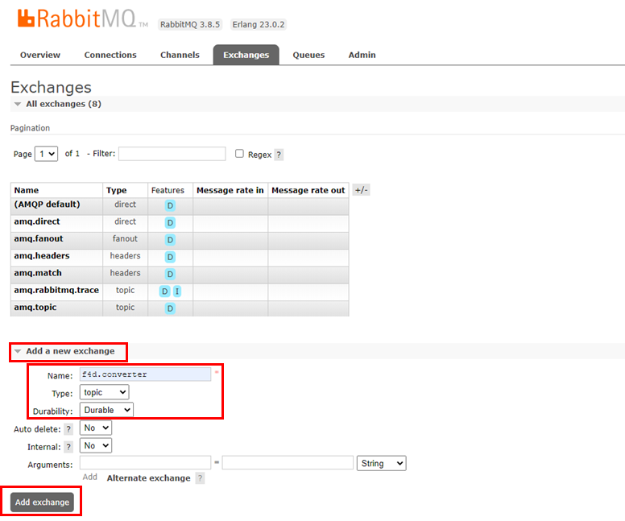

- Click [Queues] tab at the topside.

- Click [Add a new queue] at the bottomside and enter as the following screen. Click [Add queue] button.

  

- When installing RabbitMQ for the first time, "guest" account has the permissions as Administrator. But if you access the application with this account, a connection error occurs.

- Click [Add a user] at the bottomside of Admin menu to create another admin account and enter as the following screen. Then click [Add a user] button. (ID and password are same.)

  - Username : mago3d

  - Password : mago3d 

    

- Click the newly created mago3D account under the guest account.

- Create "Current permissions" and "Current topic permissions" as the following screen. Enter the password (mago3d) at [Update this user] and click [Update user] button.

  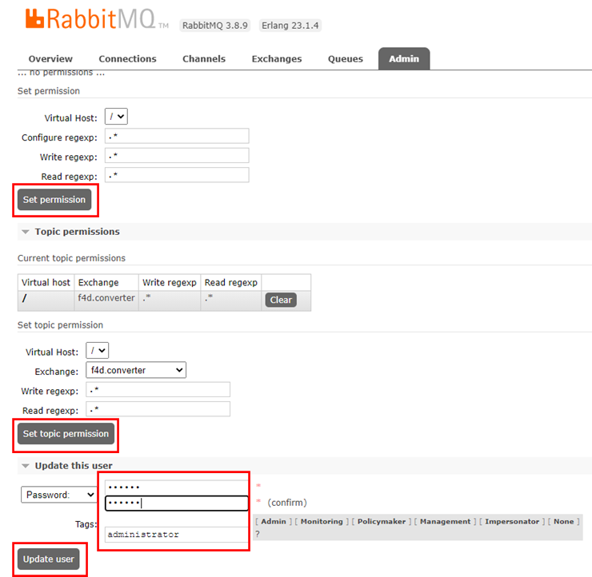


## 7. Default Table Creation and Password Update
### 1) Running SQL

- Run .sql files in [database] – [ddl] folder in [doc] folder of mago3d project, and [sequence] folder and update.sql file in [dml] folder, in this order.

- **Except reference.sql and delete.sql files. (Do not run .sql files related to reference key.)**

- **As of the project branch, use mago3D not develop.**

- You can run .sql files together by selecting & dragging them if you use pgAdmin4.

### 2) Setting password of mago3d-web application account

- Run [mago3d-admin] – [src/test/java] – [gaia3d] – [units] – passwordTest.java file as Junit Test.

- Copy encodePassword value in the console window. Update the admin password using Query Editor of pgAdmin. (update user_info set password = ‘(encodePassword value)’ where user_id=＇admin’;)

  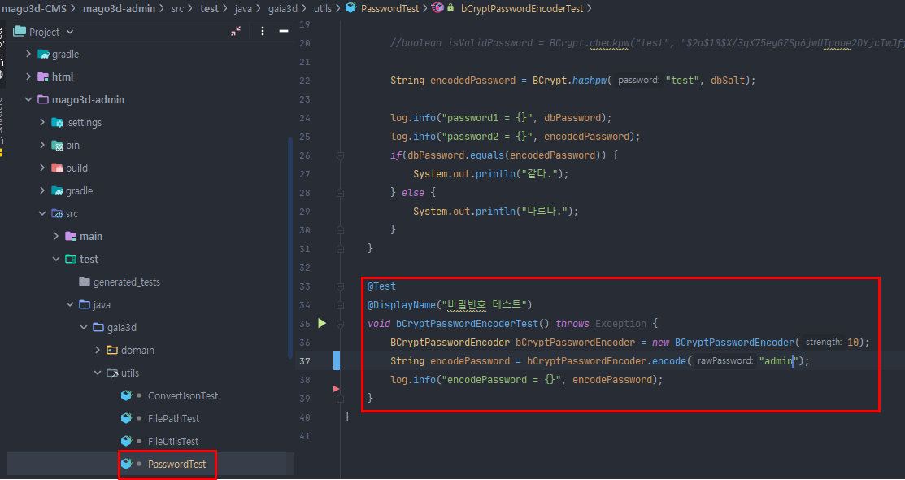

   
## 8. Setup
### 1) Creating mago3d.properties file path

- Create some folders which the application uses.

  - mago3d-admin - src - main - resources - mago3d.properties
  - mago3d-user - src - main - resources - mago3d.properties
  - mago3d-converter - src - main - resources - mago3d.properties

### 2) Setting datasource URL

- mago3d project is currently being developed to use 15432 port as datasource port; either change the port of installed PostgreSQL to 15432, or run the test codes as follows to change datasource URL in application.properties file of each project with encrypted values.

  - Test codes path for the encryption : common - src - test - java -gaia3d - security - CryptTest

  - mago3d-admin - src - main - resources - application.properties

  - mago3d-user - src - main - resources - application.properties

    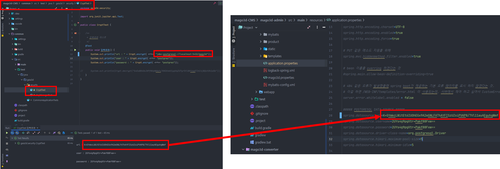

- If you change the port of PostgreSQL to 15432, The port of PostGIS Stores of GeoServer also needs to be changed to 15432.


## 9. Layer Upload Test

- Registering vector layer

  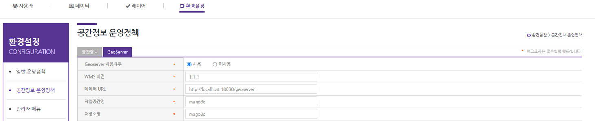

  - Layer Registration function operates via GeoServer. Thus in the [Configuration] - [Operational Policy of Spatial Information] - **[GeoServer] tap, GeoServer of data URL must be running and workspace and stores must have been created.**

  

  - Vector layer registration supports shapefiles format.
    - Modifying styles : Supports transparency, outline thickness, outline / fill color.
    - Modifying layer display order and Z-index : Layer display order is the order of layer list in the user page. The greater value, the lower display. Z-index means the order of overlapping layers.

- Registering raster layer

  

  - We do not support file upload function for raster data whose size is larger than shapefiles. The function to select and service from layer lists registered at GeoServer is supported.

- Setting Cache : For WMS services, when the status of "Use Cache" is **use** we service data cached by geowebcache and when **not use** we use the general WMS service.


## 10. 3D Data Upload Test

- Data upload test is proceeded by IDE running mago3d-user; RabbitMQ and mago3d-converver must be running for the auto-conversions of uploaded files.

- Data Group

  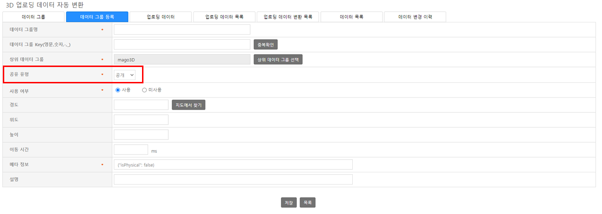

  - By default user can create extra groups as needed, with the group which has the group key called **basic**.

  - There are 4 sharing types; public, common, private, group. User can configure the group for data by these types.

- Data Upload

  

  - Supporting formats : CITYGML, INDOORGML, IFC, LAS(POINT CLOUD), 3DS, OBJ, COLADA(DAE)

  - User can upload data by selecting ZIP file or each files and specifying the upload location.

- Data Conversion

  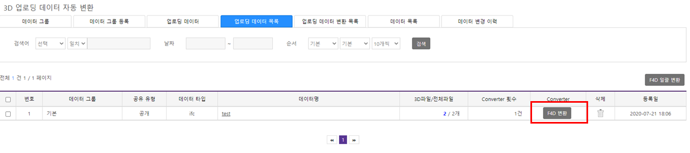

  - Select a file from uploaded files and click [F4D Conversion] button to convert it into F4D format.

- Data Visualization and Search

  

  - The uploaded object will be displayed on the map if the file conversion succeeds.

  - User can search data by group, type, and name.
