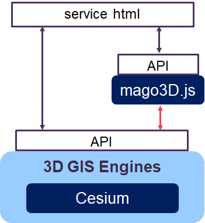
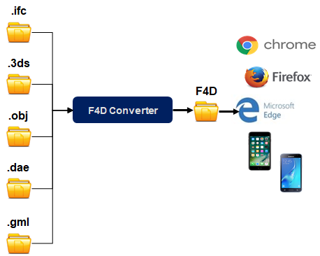
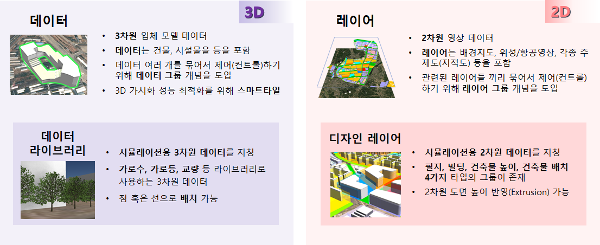

# mago3D 문서 작업 저장소

Repository for mago3D documents. 

# 목차

1. [mago3D 소개](#mago3d-소개)
2. [mago3D 활용 가이드](#mago3d-활용-가이드)
3. [도메인(용어) 설명](#도메인용어-설명)

## mago3D 소개 

### **1. mago3D 정의**

> 사용자가 초 대용량 3차원 BIM/AEC/GIS 데이터를 업로드, 자동변환, 웹 브라우저로 가시화, 공유, 협업하고 현실에서 발생할 수 있는 각종 현상을 가상공간에서 시뮬레이션 하는 디지털 트윈 플랫폼.

### **2. mago3D 특징** 

- 3D GIS 환경 위에서 실내외 공간의 끊김 없는 통합
- 웹 브라우저 상에서 구동, 별도의 add-on 이나 ActiveX 설치 필요 없음 
- 오픈소스기반 개발, 개발성과 확장성 확보
- 초대용량 3차원 파일의 효율적 관리 및 초고속렌더링 

### **3. 아키텍쳐**

### **4. mago3D 구성**

- **mago3d** [GitHub - Gaia3D/mago3d: mago3D 최신 버전](https://github.com/Gaia3D/mago3d) 
- **mago3d-js** [GitHub - Gaia3D/mago3djs: 3D Rendering Library](https://github.com/Gaia3D/mago3djs) 
- **mago3d-converter** [GitHub - Gaia3D/NewF4DConverter](https://github.com/Gaia3D/NewF4DConverter) 
- **mago3d-tiler** [GitHub - Gaia3D/SmartTiler](https://github.com/Gaia3D/SmartTiler) 

 

| **구성**             | **설명**                                                     |
| :------------------- | :----------------------------------------------------------- |
| **mago3d**           | mago3d 플랫폼 * 사용자/관리자 시스템으로 구성 * 데이터 변환 자동화 (3D/2D) * Rule-Based Management System * 스마트 타일링 * 시뮬레이션 * 대시보드, 사용자, Role, 메뉴 등 관리기능 * 시스템 환경 설정 * 사용자별 환경설정 |
| **mago3d-js**        | 3D 다중 블록 가시화를 위한 오픈소스 자바스크립트 라이브러리  |
| **mago3d-converter** | * 3D 형식(IFC, 3DS, OBJ, DAE, JT)을 mago3D 서비스 전용 포맷인 F4D로 변환 * 변환 과정에서 빠른 렌더링을 위해 데이터 크기 축소 및 사전 처리를 수행  |
| **mago3d-tiler**     | * mago3d 플랫폼에서 사용 가능한 스마트 타일 형태로 F4D를 타일링 * 전체 데이터를 불러오지 않고 화면에 들어오며, 카메라와의 거리를 따진 타일의 데이터만 호출  |

## mago3D 활용 가이드

### [mago3D 설치 가이드](./installation_guide.md)

  * [Windows](./windows_installation.md)
  * [CentOS](./linux_installation.md)

### [mago3D 개발자 가이드](./developer_guide.md)

0. [mago3D 아키텍처 및 구성](./developer_guide.md#0-mago3d-아키텍처-및-구성)
1. [개발환경 구축](./developer_guide.md#1-개발환경-구축)
2. [프로젝트 구성](./developer_guide.md#2-프로젝트-구성)
3. [DataGroup, DataInfo와  F4D와의 관계](./developer_guide.md#3-datagroup-datainfo와-f4d의-관계)
4. [RabbitMQ 동작 이해하기](./developer_guide.md#4-rabbitmq-동작-이해하기)
5. [3차원 데이터 자동 변환](./developer_guide.md#5-3차원-데이터-자동-변환)
6. [레이어 관리](./developer_guide.md#6-레이어-관리)
7. [권한 관리](./developer_guide.md#7-권한-관리)
8. [정적 컨텐츠 갱신](./developer_guide.md#8-정적-컨텐츠-갱신)
9. [암호화](./developer_guide.md#9-암호화)
10. [메모리 캐시](./developer_guide.md#10-메모리-캐시)
11. [자바](./developer_guide.md#11-자바)
12. [DB 규약](./developer_guide.md#12-db-규약)
13. [코딩 규약](./developer_guide.md#13-코딩-규약)
14. [빌드](./developer_guide.md#14-빌드)
15. [로깅](./developer_guide.md#15-로깅)
16. [Web/ WAS Server 차이점](./developer_guide.md#16-webwas-server-차이점)
17. [Web/WAS Server 연동 및 테스트](./developer_guide.md#17-web--was-server-연동-및-테스트)
18. [Tomcat 설정](./developer_guide.md#18-tomcat-설정)
19. [서비스 등록](./developer_guide.md#19-서비스-등록)
20. [Windows 서버 구축하기](./developer_guide.md#20-windows-서버--구축하기미션)

### [mago3D 사용자 가이드](./user_guide.md)

1. [데이터 변환 및 가시화](./user_guide.md#1-데이터-변환-및-가시화)
2. [레이어 서비스(관리자)](./user_guide.md#2-레이어-서비스관리자)
3. [사용자 관리(관리자)](./user_guide.md#3-사용자-관리관리자)
4. [메뉴(관리자)](./user_guide.md#4-메뉴관리자)
5. [환경설정(관리자)](./user_guide.md#5-환경설정관리자)

### [mago3D-js 사용 가이드](./mago3d-js.md)

1. [소개](./mago3d-js.md#1-소개)
2. [Dependency](./mago3d-js.md#2-dependency)
3. [Test  환경 설치](./mago3d-js.md#3-test-환경-설치)
4. [시작하기](./mago3d-js.md#4-시작하기)
5. [Data 등록](./mago3d-js.md#5-data-등록)
6. [API 소개](./mago3d-js.md#6-api--소개)
7. [이벤트 처리](./mago3d-js.md#7-이벤트-처리)

## 도메인(용어) 설명

|       **용어**        | **설명**                                                     |
| :-------------------: | :----------------------------------------------------------- |
|      **데이터**       | * 3차원 입체 모델 데이터   * 데이터는 건물, 시설물을 등을 포함 * 데이터 여러 개를 묶어서 제어(컨트롤)하기 위해 데이터 그룹 개념을 도입 |
|      **레이어**       | * 2차원 영상 데이터 * 레이어는 배경지도, 위성/항공영상, 각종 주제도(지적도) 등을 포함 * 관련된 레이어들 끼리 묶어서 제어(컨트롤)하기 위해 레이어 그룹 개념을 도입 |
| **데이터 라이브러리** | * 시뮬레이션용 3차원 데이터를 지칭 * 가로수, 가로등, 교량 등 라이브러리로 사용하는 3차원 데이터 * 점 혹은 선으로 배치 가능 |
|   **디자인 레이어**   | * 시뮬레이션용 2차원 데이터를 지칭 * 2차원 데이터의 높이 속성을 반영(Extrusion) 가능 |
|    **스마트 타일**    | * 3D 가시화 성능 최적화를 위해 스마트타일 * 타일 데이터는 피라미드 구조 * 스마트 타일이란 3차원 데이터를 타일 구조로 저장하고 가시화하는 방법 * 전체 데이터를 불러오지 않고 화면에 들어오며, 카메라와의 거리를 따진 타일의 데이터만 호출 |

