# 목차 
0. [설치 버전 확인 및 디렉토리 설정](https://github.com/endofcap/mago3D-Documentations/blob/main/installation_guide.md)
1. [Java](#1-java)
2. [PostgreSQL/PostGIS](#2-postgresqlpostgis)
3. [GDAL](#3-gdal)
4. [RabbitMQ](#4-rabbitmq)
5. [GeoServer](#5-geoserver)
6. [mago3D](#6-mago3d)
7. [Nginix](#7-nginix) 
8. [Firewall과 서비스 관리](#8-firewall--service-관리)
9. [F4D Converter](#9-f4d-converter)

## 1. Java

- 서버를 단독으로 사용하고 있다면 yum 으로 os 전역에 설치할 수도 있지만, 서버를 단독으로 사용하는 경우가 아니라면 yum 으로 설치시 다른 시스템에도 영향을 미칠 수 있으므로 파일로 다운받아 사용하도록 한다. 여기서는 yum 으로 java 를 설치한다. 

- 먼저 java 가 설치되어 있는지 확인한다. rpm 또는 yum 명령으로 확인 할 수 있다. 

  ```
  rpm -qa | grep java 
  또는 
  yum list installed | grep java
  ```

  

- java 설치전 설치할 java 버전이 저장소에 있는지 확인한다. 

  - 

- java 설치

  - java 11버전

    ```
    sudo yum install -y java-11-openjdk
    ```

  - java 16버전 (2021.07.14 현재)

    ```
    sudo yum install -y java-latest-openjdk
    ```

  - 압푹 파일로 받을 경우 (압축을 풀어서, java 버전별로 모아서 관리)

    ```
    tar -xvf openjdk-11.0.2_linux-x64_bin
    ```

  - Java 환경변수 설정 (설치 경로에 맞게 설정)

    ```
    vi ~/.bash_profile
    ```

    ```
    # JAVA_PATH
    export JAVA_HOME=/home/gaia3d/mago3d/tools/java/jdk-11.0.2
    export PATH=$PATH:$JAVA_HOME/bin
    export CLASSPATH=$CLASSPATH:$JAVA_HOME/lib/*
    ```

    ```
    source ~/.bash_profile
    ```

- 버전 관리하기

  - 기존에 java 가 설치되어 있었기 때문에 11 버전을 설치해도 전역에서 사용하는 java 버전은 바뀌지 않는다. 

  - 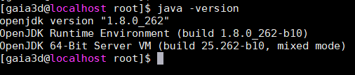

  - **alternatives**(심볼릭 링크를 관리할 수 있는 툴) 이용해서 설치된 자바 버전 중 11 버전을 선택해 심볼릭 링크를 설정해준다.

    ```
    sudo alternatives --config java
    ```

  - 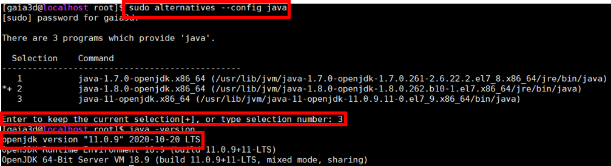

    yum으로 설치 하지 않고, 별도로 다운 받은 경우에는 별도의 심볼릭 링크를 생성해야 합니다.

  - [Ubuntu/centOS 에서 Java(JDK) 버전을 빠르게 바꾸는 방법 (update-alternatives)](https://wgtech.github.io/posts/2019/07/14/Change-the-JDK-using-update-alternatives/) 

    - JDK  설치 위치를 전부 파악

      - 보통 JDK는 /usr/lib/jvm에 설치되어 있다. (꼭! 확인이 필요합니다.)

    - 별도의 심볼릭 링크를 생성 (sudo와 chown 옵션을 활용하여 개발에 지장없게끔 설정할 필요가 있다.

      ```
      mkdir -R /opt/jdk
      ln -s /usr/lib/jvm/java-7-openjdk /opt/jdk/current
      ```

    - update-alternatives로 등록

      ```
      update-alternatives --install /usr/bin/java java /opt/jdk/current/bin/java 1
      update-alternatives --config java
      ```

> **update-alternatives install 옵션 사용 방식**
> alternatives --install <link> <name> <path> <priority 

## 2. PostgreSQL/PostGIS

- 저장소 추가 

  - epel 저장소 :  Fedora Project 에서 제공되는 저장소로 각종 패키지의 최신 버전을 제공하는 community 기반의 저장소.  F4DConverter 빌드 및 postgis 설치시 libdap, hdf4 등 epel 저장소에 의존성이 있는 패키지가 있기 때문에 postgis 설치전에 반드시 추가해줘야 한다. 

  - pgdg 저장소 :  postgresql 최신 버전을 설치하기 위해 추가 

    ```
    sudo yum -y install epel-release
    sudo yum install -y https://download.postgresql.org/pub/repos/yum/reporpms/EL-7-x86_64/pgdg-redhat-repo-latest.noarch.rpm
    ```

  - 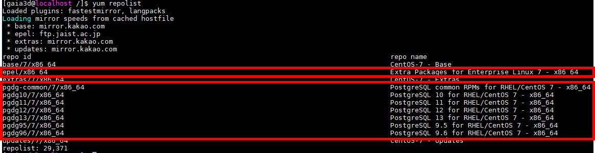

- postgresql 설치 

  - 설치가능한 버전을 확인 

    ```
    yum list | grep postgresql12
    ```

    - 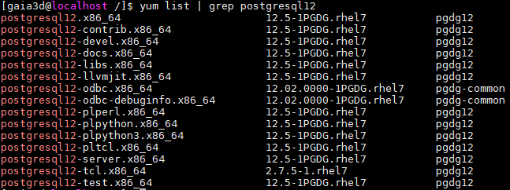

  - 어떤 것을 설치할 것인가? 

    - 버전별로 설치할 수 있는 목록이 많이 있는데 https://yum.postgresql.org/ 여기에서 각 버전별 차이점을 확인 할 수 있다. 
    - 위 사이트에서 안나오는 설치 항목에 대한 설명은 https://pkgs.org/ 라는 리눅스 패키지 검색 사이트에서 확인 할 수 있다.
      - postgresql12 : postgresql client 
      - postgresql12-contrib : 다양한 extension 들이 포함된 버전 
      - postgresql12-server : 기본적인 postgresql12 server 설치 버전 
      - postgresql12-tcl : postgresql 을 위한 tcl client 라이브러리 

  - 설치

    ```
    sudo yum install -y postgresql12-server
    ```

- postgis 설치 

  - 설치하는 패키지명은 postgis버전명_postgresql버전 이다.

    ```
    sudo yum install -y postgis30_12
    ```

- initdb

  - 먼저 /data/postgres 폴더를 root 로 생성했기 때문에 postgres 로 owner & group 를 변경해준다. 

    ```
    sudo chown -R postgres:postgres /data/postgres
    ```

    - 

  - postgres 계정으로 변경 후 /data/pg-data 경로로 initdb 실행 

    ```
    sudo su postgres
    /usr/pgsql-12/bin/initdb -D /data/postgres/ -E UTF-8
    exit (로그아웃. 다시 gaia3d 계정으로 전환)
    ```

    - 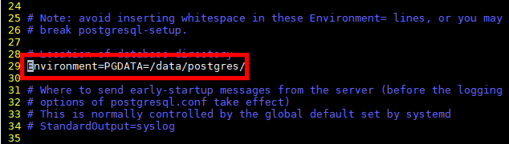

    - service 파일 PGDATA 경로 변경 

      ```
      sudo vim /usr/lib/systemd/system/postgresql-12.service
      ```

      - 

      - systemctl reload

        ```
        sudo systemctl daemon-reload 
        ```

      - pruning 설정 : table partition 기능을 사용하기 위해서 활성화 해준다. 

        ```
        sudo su postgres
        vim /data/postgres/postgresql.conf
        ```

        - 

      - postgresql 시작 & status 확인

        ```
        exit (gaia3d 계정으로 변경)
        sudo systemctl start postgresql-12
        sudo systemctl status postgresql-12
        ```

        - 

- 테스트

  - postgis extension 설치가 정상적으로 되는지와 데이터 경로를 확인 한다. 

    ```
    sudo su postgres
    psql -U posgres
    ```

    ```
    create extension postgis;
    select postgis_version();
    show data_directory;
    ```

    - 

## 3. GDAL

- f4d converter 빌드시 gdal31-devel 을 사용하기 때문에 gdal31 버전을 설치하도록 한다. gdal 을 설치하는 이유는 ogr2ogr 을 이용해서 shape 데이터를 db 에 insert * append 하기 위해 사용한다. 

  ```
  sudo yum install gdal31
  ```

- ogr2ogr path 추가

  - mago3d application 에서 ogr2ogr 을 사용할 수 있도록 하기 위해 path 에 추가 해준다. 

    ```
    vim ~/.bash_profile 
    ```

  - 

  - 

## 4. RabbitMQ

- rabbitmq 는 erlang 이라는 프로그래밍 언어로 만들어졌기 때문에 rabbitmq  설치전 erlang 을 설치해줘야한다. 각 버전별 필요한 erlang 버전은 공식 홈페이지에서 확인 가능하다.(https://www.rabbitmq.com/which-erlang.html)

- erlnag 설치를 위해 저장소를 설치한다. 

  ```
  sudo yum install http://packages.erlang-solutions.com/erlang-solutions-1.0-1.noarch.rpm
  ```

  - 

- erlang & rabbitmq 설치

  ```
  sudo yum install erlang
  sudo yum install https://dl.bintray.com/rabbitmq/all/rabbitmq-server/3.8.5/rabbitmq-server-3.8.5-1.el7.noarch.rpm
  ```

- management 플러그인 설치 및 rabbitmq 시작

  ```
  sudo /usr/sbin/rabbitmq-plugins enable rabbitmq_management
  sudo systemctl start rabbitmq-server
  ```

- RabbitMQ 관리자 페이지([http://localhost:15672](http://localhost:15672/))에 접속한다.
- 아이디와 비밀번호는 모두 guest로 로그인한다.


- 상단에 Exchange 탭을 클릭한다.

- 하단에 Add a new exchanges를 클릭하여 우측 그림과 같이 입력한 뒤, Add exchange 버튼을 클릭한다.

  - *Name : f4d.converter*
  - *Type : topic*
  - *Durability : Durable*

  

- 상단에 Queues 탭을 클릭한다.

- 하단에 Add a new queue를 클릭하여 우측 그림과 같이 입력한 뒤, Add queue 버튼을 클릭한다.

  

- RabbitMQ를 처음 설치하면 guest 계정이 Administrator로 권한 설정되어 있다. 하지만 이 계정으로 application에 접속할 시, 접속 관련 오류가 발생한다.

- 다른 관리자 계정을 생성하기 위해 Admin 메뉴 하단의 Add a user를 클릭하고 우측 그림과 같이 입력하여 관리자 계정을 생성한다. (아이디와 비밀번호는 동일하다.)

  - Username : mago3d

  - Password : mago3d 

    

- guest 아래에 새로 생성된 mago3d계정을 클릭한다.

- 아래 화면과 같이 Current permissions, Current topic permissions을 생성하고 Update this user에 비밀번호(mago3d)를 입력한 뒤, 하단의 Update user 버튼을 클릭한다.

  

## 5. GeoServer 

- tomcat

  - 다운로드 & 압축해제

    ```
    wget -P /home/gaia3d/mago3d/setup/ https://downloads.apache.org/tomcat/tomcat-9/v9.0.41/bin/apache-tomcat-9.0.41.tar.gz
    cd /home/gaia3d/mago3d/tools/
    tar -xvzf /home/gaia3d/mago3d/setup/apache-tomcat-9.0.41.tar.gz -C .
    mv apache-tomcat-9.0.41 geoserver-tomcat
    rm -rf geoserver-tomcat/webapps/*
    ```

  - cors 설정 

    ```
    vim /home/gaia3d/mago3d/tools/geoserver-tomcat/conf/web.xml
    ```

    - 가장 하단의 </web-app> 위에 설정을 넣어준다. 

      ```
      <filter>
        <filter-name>CorsFilter</filter-name>
        <filter-class>org.apache.catalina.filters.CorsFilter</filter-class>
        <init-param>
          <param-name>cors.allowed.origins</param-name>
          <param-value>*</param-value>
        </init-param>
        <init-param>
          <param-name>cors.allowed.methods</param-name>
          <param-value>GET,POST,HEAD,OPTIONS,PUT</param-value>
        </init-param>
        <init-param>
          <param-name>cors.allowed.headers</param-name>
          <param-value>Content-Type,X-RequestedWith,accept,Origin,Access-Control-Request-Method,Access-ControlRequest-Headers</param-value>
        </init-param>
        <init-param>
          <param-name>cors.exposed.headers</param-name>
          <param-value>Access-Control-Allow-Origin,Access-Control-AllowCredentials</param-value>
        </init-param>
        <init-param>
          <param-name>cors.preflight.maxage</param-name>
          <param-value>10</param-value>
        </init-param>
      </filter>
      <filter-mapping>
       <filter-name>CorsFilter</filter-name>
       <url-pattern>/*</url-pattern>
      </filter-mapping>
      ```

- geoserver

  ```
  cd /home/gaia3d/tools/geoserver-tomcat/webapps/
  wget http://sourceforge.net/projects/geoserver/files/GeoServer/2.17.3/geoserver-2.17.3-war.zip
  unzip geoserver-2.17.3-war.zip 
  find . ! -name "geoserver.war" -delete
  ```

- service 등록

  ```
  sudo vim /usr/lib/systemd/system/mago3d-geoserver.service
  ```

  ```
  [Unit]
  Description=mago3d-geoserver
  After=syslog.target
  
  [Service]
  Type=forking
  User=gaia3d
  Group=gaia3d
  ExecStart=/home/gaia3d/mago3d/tools/geoserver-tomcat/bin/startup.sh
  ExecStop=/home/gaia3d/mago3d/tools/geoserver-tomcat/bin/shutdown.sh
  SuccessExitStatus=143
  
  [Install]
  WantedBy=multi-user.target
  ```

  ```
  sudo systemctl daemon-reload
  ```

- data_dir 변경 및 jvm size 설정 

  ```
  vim /home/gaia3d/mago3d/tools/geoserver-tomcat/bin/setenv.sh
  ```

  ```
  export CATALINA_OPTS="$CATALINA_OPTS -Xms4096m"
  export CATALINA_OPTS="$CATALINA_OPTS -Xmx4096m"
  export GEOSERVER_DATA_DIR=/data/geoserver
  ```

- data_dir 권한 변경 

  ```
  sudo chown -R gaia3d:gaia3d /data/geoserver
  ```

- 서비스 시작 

  ```
  sudo systemctl start mago3d-geoserver
  ```

  - 로그 설정 

    - geoserver 를 실행하게 되면 설정한 data 폴더내에 logging.xml 이 생성된다. 생성된 파일에 다음과 같이 설정한다.

      ```
      <logging>
        <level>DEFAULT_LOGGING.properties</level>
      <location>/home/gaia3d/mago3d/tools/geoserver-tomcat/logs/geoserver.log</location>
        <stdOutLogging>true</stdOutLogging>
      </logging>
      ```

    - geoserver 를 재기동 하면 logs 폴더가 생긴다. logs 폴더 안의 DEFAULT_LOGGING.properties 파일을 다음과 같이 수정한다.

      ```
      log4j.appender.geoserverlogfile.MaxBackupIndex=30 
      log4j.appender.geoserverlogfile.MaxFileSize=200MB 
      ```

    - 

    - catalina.out 파일은 모든 로그가 한 파일에 계속 쌓이기 때문에 서버 운영을 계속 하다보면 너무 커지게 되므로 catalina.out 파일이 생성되지 않도록 수정한다. 

      ```
      vim /home/gaia3d/mago3d/tools/geoserver-tomcat/bin/catalina.sh
      ```

      ```
      CATALINA_OUT=/dev/null
      ```

    - 

## 6. mago3D 

- 서비스에 필요한 폴더 생성 

  ```
  sudo chown -R gaia3d:gaia3d /data/mago3d
  ```

  ```
  mkdir /data/mago3d/f4d/
  mkdir -p /data/mago3d/f4d/data-logs/
  mkdir -p /data/mago3d/f4d/infra/data/
  mkdir -p /data/mago3d/f4d/service/data/
  mkdir /data/mago3d/upload-data/
  mkdir /data/mago3d/bulk-upload-data/
  mkdir /data/mago3d/smart-tiling/
  mkdir /data/mago3d/attribute/
  mkdir -p /data/mago3d/mago3d-admin/upload/layer/
  mkdir -p /data/mago3d/mago3d-admin/export/temp/
  mkdir -p /data/mago3d/guide/f4d/
  ```

- 디비 & 테이블 생성 

  - mago3D 프로젝트의 doc/database 폴더를 서버로 복사한다. 파일 복사를 위한 툴로 여기서는 pscp.exe 을 사용한다.

    ```
    pscp.exe -r D:\source\mago3d-CMS\doc\database gaia3d@서버IP:/tmp
    ```

  - 복사한 폴더를 postgres 소유로 변경한다. 

    ```
    sudo chown -R postgres:postgres /tmp/database
    ```

  - psql 로 sql 파일들을 실행한다. 

    ```
    sudo su postgres
    cd /tmp/database
    ```

    - database 생성 : database.sql 을 실행하고 psql 로 db 에 접속해서 database 생성 여부 확인.

      ```
      psql -U postgres -f database.sql
      psql -U postgres 
      \l
      \q
      ```

      - 

      - postgis extension 설치 

        ```
        psql -U postgres -d mago3d
        create extension postgis;
        \q
        ```

    - ddl 

      ```
      psql -U postgres -d mago3d -f ddl/sequence/sequence.sql
      ```

      - 실행할 파일들이 많기 때문에 리눅스 명령어로 하나의 파일로 합쳐서 실행하도록 한다. **constraint/reference.sql 은 실행하지 않는다.**

        ```
        ls ddl/*.sql | xargs cat > ddl.sql
        psql -U postgres -d mago3d -f ddl.sql
        ```

    - dml

      ```
      psql -U postgres -d mago3d -f dml/insert.sql
      psql -U postgres -d mago3d -f dml/update.sql
      ```

    - index 

      ```
      psql -U postgres -d mago3d -f index/access_log.sql
      psql -U postgres -d mago3d -f index/data_info_log.sql 
      psql -U postgres -d mago3d -f index/index.sql
      ```

- 프로젝트 빌드

  - 프로젝트 root 경로에서 clean & build  

    ```
    gradlew.bat clean
    gradlew.bat build -Pprofile=develop `
    ```

  - 파일 복사 

    ```
    pscp.exe D:\source\mago3d-CMS\mago3d-admin\build\libs\mago3d-admin-0.0.1-SNAPSHOT.war gaia3d@서버IP:/home/gaia3d/mago3d/setup/
    pscp.exe D:\source\mago3d-CMS\mago3d-user\build\libs\mago3d-user-0.0.1-SNAPSHOT.war gaia3d@서버IP:/home/gaia3d/mago3d/setup/
    pscp.exe D:\source\mago3d-CMS\mago3d-converter\build\libs\mago3d-converter-0.0.1-SNAPSHOT.jar gaia3d@서버IP:/home/gaia3d/mago3d/setup/
    ```

- mago3d-tomcat

  - geoserver 설치시 다운받은 tomcat 압축 파일을 이용한다. 

    ```
    cd /home/gaia3d/mago3d/tools/
    tar -xvzf /home/gaia3d/mago3d/setup/apache-tomcat-9.0.41.tar.gz -C .
    mv apache-tomcat-9.0.41 mago3d-tomcat
    rm -rf mago3d-tomcat/webapps/*
    ```

  - 톰캣에 폴더 생성하고 war 파일 압축 해제 

    ```
    mkdir -p /home/gaia3d/mago3d/tools/mago3d-tomcat/source/mago3d-admin
    mkdir /home/gaia3d/mago3d/tools/mago3d-tomcat/source/mago3d-user
    
    unzip /home/gaia3d/mago3d/setup/mago3d-admin-0.0.1-SNAPSHOT.war -d /home/gaia3d/mago3d/tools/mago3d-tomcat/source/mago3d-admin/
    unzip /home/gaia3d/mago3d/setup/mago3d-user-0.0.1-SNAPSHOT.war -d /home/gaia3d/mago3d/tools/mago3d-tomcat/source/mago3d-user/
    ```

  - server.xml 파일 수정. 톰캣 인스턴스 하나로 admin/user 를 모두 서비스 할 수 있도록 수정한다.

    - shutdown port 는 geoserver 8005 를 이미 사용중이므로 다른 포트를 사용하도록 한다.

    - 

      ```
      <Service name="Catalina">
      
          <Connector port="10080" protocol="HTTP/1.1"
                     connectionTimeout="20000"
                     redirectPort="8444" />
         
          <Engine name="Catalina" defaultHost="localhost">
          
            <Realm className="org.apache.catalina.realm.LockOutRealm">
              
              <Realm className="org.apache.catalina.realm.UserDatabaseRealm"
                     resourceName="UserDatabase"/>
            </Realm>
      
            <Host name="localhost"  appBase="webapps"
                  unpackWARs="true" autoDeploy="false">
           
              <Valve className="org.apache.catalina.valves.AccessLogValve" directory="logs"
                     prefix="localhost_access_log" suffix=".txt"
                     pattern="%h %l %u %t &quot;%r&quot; %s %b" />
      		<Context docBase="/home/gaia3d/mago3d/tools/mago3d-tomcat/source/mago3d-user" path="" reloadable="false" />
            </Host>
          </Engine>
        </Service>
        
        <Service name="Catalina2">
      
          <Connector port="19090" protocol="HTTP/1.1"
                     connectionTimeout="20000"
                     redirectPort="8445" />
      
             <Engine name="Catalina2" defaultHost="localhost">
          
            <Realm className="org.apache.catalina.realm.LockOutRealm">
              
              <Realm className="org.apache.catalina.realm.UserDatabaseRealm"
                     resourceName="UserDatabase"/>
            </Realm>
      
            <Host name="localhost"  appBase="webapps"
                  unpackWARs="true" autoDeploy="false">
           
              <Valve className="org.apache.catalina.valves.AccessLogValve" directory="logs"
                     prefix="localhost_access_log2" suffix=".txt"
                     pattern="%h %l %u %t &quot;%r&quot; %s %b" />
      		<Context docBase="/home/gaia3d/mago3d/tools/mago3d-tomcat/source/mago3d-admin" path="" reloadable="false" />
            </Host>
          </Engine>
        </Service>
      ```

  - 캐시 리소스 

    ```
    vim /home/gaia3d/mago3d/tools/mago3d-tomcat/conf/context.xml
    ```

    - context.xml 파일의 context 태그안에 아래의 내용을 추가한다.

    ```
    <Resources cachingAllowed="true" cacheMaxSize="100000"/>
    ```

  - service 등록 

    ```
    sudo vim /usr/lib/systemd/system/mago3d-tomcat.service
    ```

    ```
    [Unit]
    Description=mago3d-tomcat
    After=syslog.target
    
    [Service]
    Type=forking
    User=gaia3d
    Group=gaia3d
    ExecStart=/home/gaia3d/mago3d/tools/mago3d-tomcat/bin/startup.sh
    ExecStop=/home/gaia3d/mago3d/tools/mago3d-tomcat/bin/shutdown.sh
    SuccessExitStatus=143
    
    [Install]
    WantedBy=multi-user.target
    ```

    ```
    sudo systemctl daemon-reload
    ```

  - jvm 사이즈 설정 

    ```
    vim /home/gaia3d/mago3d/tools/mago3d-tomcat/bin/setenv.sh
    ```

    ```
    export CATALINA_OPTS="$CATALINA_OPTS -Xms4096m"
    export CATALINA_OPTS="$CATALINA_OPTS -Xmx4096m"
    ```

  - catalina.out 파일 disable 

    ```
    vim /home/gaia3d/mago3d/tools/mago3d-tomcat/bin/catalina.sh
    ```

    ```
    CATALINA_OUT=/dev/null
    ```

    - 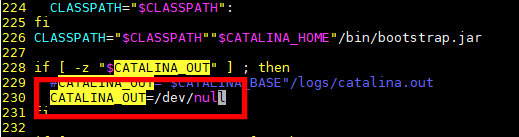

  - 서비스 시작

    ```
    sudo systemctl start mago3d-tomcat
    ```

- mago3d-converterk

  - war 파일이 아닌 단독으로 실행되는 jar 파일이기 때문에 톰캣을 사용하지 않고 바로 서비스를 등록해서 사용한다.

    ```
    cp /home/gaia3d/mago3d/setup/mago3d-converter-0.0.1-SNAPSHOT.jar /home/gaia3d/mago3d/tools/mago3d-converter/
    ```

    ```
    sudo vim /usr/lib/systemd/system/mago3d-converter.service
    ```

    ```
    [Unit]
    Description=mago3d-converter
    After=syslog.target
    
    [Service]
    Type=simple
    User=gaia3d
    Group=gaia3d
    WorkingDirectory=/home/gaia3d/mago3d/tools/mago3d-converter
    PIDFile=/home/gaia3d/mago3d/tools/mago3d-converter/bin/app.pid
    Environment=DISPLAY=:99
    Environment=LD_LIBRARY_PATH=$LD_LIBRARY_PATH:/home/gaia3d/mago3d/tools/f4dconverter/lib:/usr/local/lib
    ExecStart=/bin/bash -c "exec java -Xmx4096m -jar /home/gaia3d/mago3d/tools/mago3d-converter/mago3d-converter-0.0.1-SNAPSHOT.jar"
    
    SuccessExitStatus=143
    
    [Install]
    WantedBy=multi-user.target
    ```

  - xvfb(X Virtual Frame Buffer) 

    - 로컬 혹은 리모트 서버에 X로 접속하거나 띄우지 않고 콘솔로만 접속하여 윈도우 콘솔 프로그램을 돌리고자 할 경우에 사용하는 **Display server**이다. `Xvfb`는 여타 다른 Display server와 다르게 보여지는 output 없이 메모리 수준에서 graphic operation을 수행한다. 따라서 `Xvfb`가 수행되는 서버(컴퓨터)에서는 보여주기위한 출력장치나 입력장치가 존재하지 않아도 된다.([http://plus4070.github.io/nhn entertainment devdays/2016/03/27/Xvfb/](http://plus4070.github.io/nhn%20entertainment%20devdays/2016/03/27/Xvfb/))

    - xvfb 설치 
      - sudo yum list | grep -i xvfb 명령으로 xvfb 를 respository 에서 검색해서 나오는 항목을 설치한다. 
      
      - 
      
      - ```
        sudo yum install xorg-x11-server-Xvfb
        ```
      
    - xvfb 서비스 등록 
      - **mago3d-converter 서비스 스크립트의 DISPLAY 값과  xvfb 서비스 스크립트의 /usr/bin/Xvfb 의 argument 값이 같아야 한다.**
      
        ```
        sudo vim /usr/lib/systemd/system/xvfb.service
        ```
      
        ```
        [Unit]
        Description=X Virtual Frame Buffer Service
        After=network.target
        
        [Service]
        ExecStart=/usr/bin/Xvfb :99 -ac -screen 0 1920x1080x24 -nolisten tcp
        
        [Install]
        WantedBy=multi-user.target
        ```
      
    - 서비스 시작 

      ```
      sudo systemctl daemon-reload
      
      sudo systemctl start mago3d-converter
      sudo systemctl start xvfb
      ```

## 7. Nginix

- 저장소 추가 

  ```
  sudo vim /etc/yum.repos.d/nginx.repo
  ```

  ```
  [nginx] 
  name=nginx repo 
  baseurl=http://nginx.org/packages/centos/7/$basearch/ 
  gpgcheck=0 
  enabled=1
  ```

  - yum repolist 명령으로 저장소가 잘 추가 되었는지 확인한다. 
    - 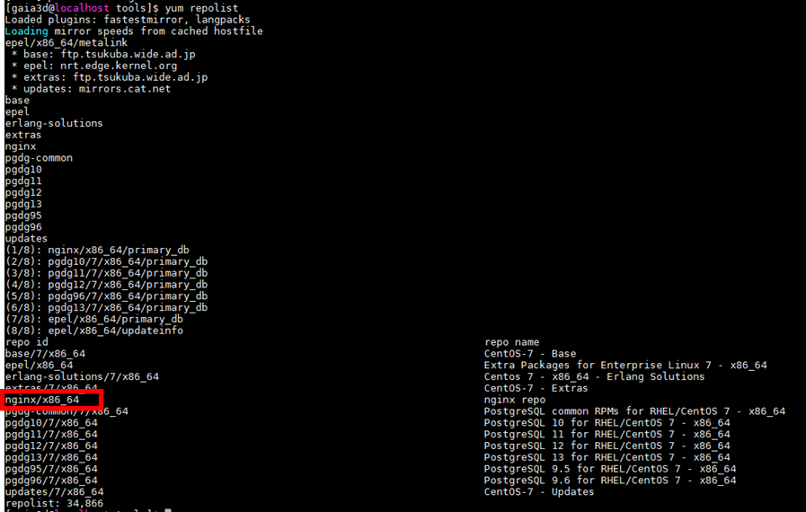

- nginx 설치 

  ```
  sudo yum install nginx
  ```

  - 참고 
    - nginx 실행파일 위치  : /usr/sbin/nginx
    - nginx 로그 파일 위치 : /var/log/nginx/

- /etc/nginx/nginx.conf 파일 설정하기(virtual hosting 설정)

  - **windows 의 nginx.conf 파일과 리눅스의 nginx.conf 파일은 다르기 때문에 수정시 주의해야 한다.** windows 의 경우 nginx.conf 파일에 모든 설정이 들어 있지만 리눅스의 경우 nginx.conf 파일과 conf.d/default.conf 파일에 각각 설정이 분리 되어 있다. 여기서는 nginx.conf 파일에 모든 설정을 하도록 한다. 

  - **listen port**로 들어온 요청을 **upstream** 으로 설정한 url로 넘겨준다.

  - nginx 폴더에 있는 **mime.types**를 꼭 포함해줘야 하는데 이 파일을 include하지 않으면 nginx에서 static한 파일들을 처리할 때 text로 주기 때문에 css나 이미지등이 깨진다.

  - nginx의 기본 파일 업로드의 사이즈가 작기 때문에 **client_max_body_size**를 꼭 설정해줘야 한다. 해당 옵션을 설정하지 않으면 nginx로 접근한 url에서 파일 업로드시 오류가 발생한다. 

  - **경로 설정시 윈도우의 경우에는 역슬래시 2개, 리눅스의 경우에는 슬러시하나**를 사용하여 경로를 써야하는것에 주의해야 한다.

    ```
    user  nginx;
    worker_processes  1;
    
    error_log  /var/log/nginx/error.log warn;
    pid        /var/run/nginx.pid;
    
    
    events {
        worker_connections  1024;
    }
    
    http {
            include         mime.types;
            #default_type  application/octet-stream;
    
            #log_format  main  '$remote_addr - $remote_user [$time_local] "$request" '
        #                  '$status $body_bytes_sent "$http_referer" '
        #                  '"$http_user_agent" "$http_x_forwarded_for"';
    
            #access_log  logs/access.log  main;
    
            sendfile        on;
            client_max_body_size 4G;
            client_body_buffer_size 256k;
    
            #tcp_nopush     on;
    
            #keepalive_timeout  0;
            client_body_timeout 10;
            client_header_timeout 10;
            keepalive_timeout  15;
            send_timeout 10;
    
            #gzip  on;
    
            upstream mago3d_user {
                    ip_hash;
                    server 127.0.0.1:10080;
            }
    
            upstream mago3d_admin {
                    ip_hash;
                    server 127.0.0.1:19090;
            }
    
            server {
                    listen       80;
                    server_name  localhost;
    
                    #charset koi8-r;
    
                    #access_log  logs/host.access.log  main;
    
                    location / {
                            #add_header 'Access-Control-Allow-Origin' '*';
                            proxy_set_header    Host $http_host;
                            proxy_set_header    X-Real-IP $remote_addr;
                            proxy_set_header    X-Forwarded-For $proxy_add_x_forwarded_for;
                            proxy_set_header    X-Forwarded-Proto $scheme;
                            proxy_set_header    X-NginX-Proxy true;
    
                            proxy_pass http://mago3d_user;
                            proxy_redirect      off;
                            charset utf-8;
                    }
    
                    location ~ ^/(css|externlib|images|js)/ {
                            root "/etc/nginx/html/mago3d-user";
                    }
    
                    #error_page  404              /404.html;
            # redirect server error pages to the static page /50x.html
    
                    error_page   500 502 503 504  /50x.html;
                    location = /50x.html {
                            root   html;
                    }
            }
    
            server {
                    listen       9090;
                    server_name  localhost;
    
                    #charset koi8-r;
                    #access_log  logs/host.access.log  main;
    
                    location / {
                            #add_header 'Access-Control-Allow-Origin' '*';
                            proxy_set_header    Host $http_host;
                            proxy_set_header    X-Real-IP $remote_addr;
                            proxy_set_header    X-Forwarded-For $proxy_add_x_forwarded_for;
                            proxy_set_header    X-Forwarded-Proto $scheme;
                            proxy_set_header    X-NginX-Proxy true;
    
                            proxy_pass http://mago3d_admin;
                            proxy_redirect      off;
                            charset utf-8;
                    }
    
                    location ~ ^/(css|externlib|images|js)/ {
                            root "/etc/nginx/html/mago3d-admin";
                    }
    
                    #error_page  404              /404.html;
            # redirect server error pages to the static page /50x.html
                    error_page   500 502 503 504  /50x.html;
                    location = /50x.html {
                            root   html;
                    }
            }
    }
    ```

- static resource 폴더 생성 및 복사 

  ```
  sudo mkdir -p /etc/nginx/html/mago3d-admin
  sudo mkdir  /etc/nginx/html/mago3d-user
  
  sudo cp -R /home/gaia3d/mago3d/tools/mago3d-tomcat/source/mago3d-admin/WEB-INF/classes/static/* /etc/nginx/html/mago3d-admin/
  sudo cp -R /home/gaia3d/mago3d/tools/mago3d-tomcat/source/mago3d-user/WEB-INF/classes/static/* /etc/nginx/html/mago3d-user/
  ```

- semanage port 추가 

  - semanage port 에 9090 이 없어서 다음과 같은 에러가 발생할 경우 

    - 

  - semanage port 추가 하기 

    - centos 설치시 devtools 를 설치 하지 않았다면 semange 툴이 없을 수도 있다. 이 경우에는 별도로 semanage 툴을 설치해야 한다.

    - nginx에서 네트워크 자원을 엑세스 할 수 있도록 아래의 rule 도 추가한다.

      ```
      sudo semanage port -m -t http_port_t -p tcp 9090
      sudo setsebool -P httpd_can_network_connect 1
      ```

- service 시작 

  ```
  sudo systemctl start nginx
  ```

## 8. Firewall & Service 관리 

- firewall 

  - 외부에서 접근 가능한 port 를 열어준다. firewall 커맨드로 port 를 열어 줄 수도 있고, /etc/firewalld/zones/ 아래의 zone에 해당하는 xml 파일을 수정해서 port 를 열어 줄수도 있다. 여기서는 firewall 커맨드를 사용하도록 한다. 

  - 외부에 오픈하는 port 는 꼭 필요한 것들만 열어주도록 한다. 

    ```
    sudo firewall-cmd --permanent --zone=public --add-port=80/tcp
    sudo firewall-cmd --permanent --zone=public --add-port=8080/tcp
    sudo firewall-cmd --permanent --zone=public --add-port=9090/tcp
    
    sudo firewall-cmd --reload
    sudo firewall-cmd --list-all
    ```

- service 

  - 서버가 재시작 되더라도 서비스가 다시 시작될 수 있도록 설정한다. 

    ```
    sudo systemctl enable postgresql-12
    sudo systemctl enable rabbitmq-server
    sudo systemctl enable xvfb
    sudo systemctl enable nginx
    sudo systemctl enable mago3d-tomcat
    sudo systemctl enable mago3d-converter
    sudo systemctl enable mago3d-geoserver
    
    sudo systemctl list-unit-files --type service | grep enabled (자동재시작 목록 확인)
    ```

    

## 9. F4D Converter 

- 환경
  - 운영체제 : CentOS 7.9 (sudo cat /etc/redhat-release)
  - 빌드도구 : CMake 3.17.3
  - 컴파일러 :  GCC 7.3.1 20180303 (Red Hat 7.3.1-5)
  - 라이브러리 

| **라이브러리** | **설치 버전** | **설치 형태**   |
| -------------- | ------------- | --------------- |
| boost          | 1.71.0        | 패키지 설치     |
| assimp         | 4.1.0         | 소스 설치(자동) |
| glad           | 0.1.11        | 소스 설치(자동) |
| glfw           | 3.2.1         | 소스 설치(자동) |
| glm            | 0.9.9.3       | 소스 설치(자동) |
| stb            | -             | 소스 설치(자동) |
| ifcplusplus    | 1.0           | 소스 설치(자동) |
| jsoncpp        | 0.10.7        | 소스 설치(자동) |
| proj.4         | 4.9.3         | 패키지 설치     |
| xerces-c       | 3.2.2-11      | 패키지 설치     |
| libcitygml     | 2.0.9         | 소스 설치(자동) |
| gdal           | 3.1           | 패키지 설치     |
| libgeotiff     | 1.4.2-10      | 패키지 설치     |
| libLAS         | 1.8.1-3       | 소스 설치(수동) |

- 빌드 환경 구성

  - GCC 컴파일러 및 관련 도구 설치

    - Software Collection 패키지 설치

      ```
      sudo yum -y install centos-release-scl
      ```

    - devtoolset-7 소프트웨어 컬렉션을 이용하여 GCC 7 을 설치하기

      ```
      sudo yum -y install devtoolset-7
      ```

    - **저장소 추가** 

      - epel, pgdg 저장소가 필요하며, postgres 설치과정을 했다면 해당 부분은 skip 하도록 한다. 만약 postgres 설치과정을 하지 않고 f4dconverter 만 단독으로 설치한다면 postgres 설치과정부분에서 저장소 추가 부분을 참고 해서 epel, pgdg 저장소를 추가하도록 한다.

  - devtoolset-7에 포함된 도구를 사용할 수 있는 쉘 환경 구성

    - 빌드를 위해 쉘 환경을 구성하는 것이기 때문에 한 번 빌드하고 다시 빌드할 일이 없다면 임시적으로 해도 상관없지만, 그렇지 않다면 .bash_profile 에 적용해서 영구적으로 사용 할 수 있도록 한다. 

    - 임시적으로 적용할 경우 

      ```
      source scl_source enable devtoolset-7
      ```

    - 영구적으로 적용할 경우

      ```
      vim ~/.bash_profile
      ```

      - 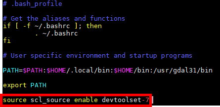

      - .bash_profile 수정 후 반영은 새로 로그인(새로운 세션)하거나 아래의 명령어를 입력해 적용 할 수 있다.

        ```
        . ~/.bash_profile
        ```

      - 적용후 gcc & g++ 버전을 확인 시 다음과 같이 나오는지 확인 

      - 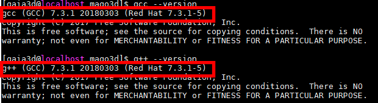

- 개발 도구 설치

  - CMake

    - CentOS 7 운영체제의 기본 저장소에서 적용되는 CMake 는 2.8 버전이기 때문에 EPEL 저장소에 있는 3.9 버전 이상으로 설치한다. 패키지명이 다르기 때문에 두 버전을 다 설치해도 무방하다. **다만 명령어가 2 버전은 cmake, 3 버전은 cmake3 로 다르다.**

    - CMake 설치가능한 버전 확인

      ```
      yum list | grep cmake
      ```

      - 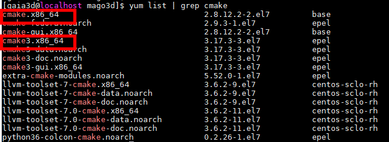

    - CMake 설치 

      ```
      sudo yum -y install cmake3
      ```

      - 설치 확인 

        ```
        cmake3 --version
        ```

        - 

  - git

    - centos 에 기본으로 깔린 git version 낮기 때문에 새로운 버전을 받아서 빌드해준다. 

      ```
      <의존성 관련 install>
      sudo yum groupinstall 'Development Tools' (os 설치 개발도구 툴을 설치했다면 skip)
      sudo yum install curl-devel expat-devel gettext-devel openssl-devel zlib-devel perl-CPAN perl-devel
      
      <compile & install>
      cd /home/gaia3d/mago3d/setup/
      wget https://mirrors.edge.kernel.org/pub/software/scm/git/git-2.18.0.tar.gz
      tar xf git-2.18.0.tar.gz
      cd git-2.18.0/
      
      make configure
      ./configure --prefix=/usr/local
      
      make all
      
      sudo make install
      ```

      - 새로운 세션으로 접속시 git version 이 올라간 것을 확인 할 수 있다. 
        - 

- 의존성 설치

  - Boost 

    ```
    sudo yum -y install boost-devel
    ```

  - GLFW

    - XWindow 라이브러리 패키지 설치 

      ```
      sudo yum -y install libXrandr-devel libXinerama-devel libXcursor-devel libXi-devel
      ```

    - Mesa 3D 그래픽 라이브러리 패키지 설치

      ```
      sudo yum -y install mesa-libGL-devel mesa-libGLU-devel
      ```

  - Proj4

    ```
    sudo yum -y install proj71-devel
    ```

  - Xerces

    ```
    sudo yum -y install xerces-c-devel
    ```

  - GDAL

    - postgres 설치과정을 하면서 gdal31 버전을 설치했다면 skip

      ```
      sudo yum -y install gdal31-devel geos38
      ```

  - Geotiff

    ```
    sudo yum -y install libgeotiff-devel
    ```

  - libLAS

    - 의존성 라이브러리 버전 확인 

      - Boost 1.38.0 버전 이상 : 필수 의존성 라이브러리로 빌드 시 사용 

        - 버전확인 

          ```
          yum list installed | grep boost
          ```

          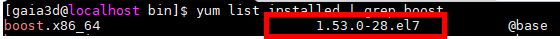

        - CMake 에서 Boost 라이브러리를 못 찾는 경우 Boost_INCLUDE_DIR, Boost_LIBRARY_DIRS 값 설정이 필요하다.

      - (옵션) GDAL 1.7 버전 이상 : 옵션이지만 빌드 시 사용

        - 버전확인 

          ```
          yum list installed | grep gdal
          ```

          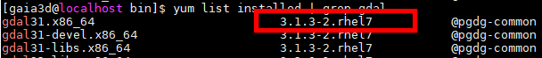

      - (옵션) libgeotiff 1.3.0 버전 이상 : 옵션이지만 빌드 시 사용

        - 버전확인

          ```
          yum list installed | grep libgeotiff
          ```

          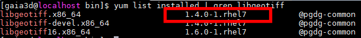

    - 소스 설치

      - Zlib 패키지 설치(git 을 새로운 버전으로 설치했다면 skip)

        ```
        sudo yum -y install zlib-devel
        ```

      - GDAL 경로 환경변수 등록

        - build 시에만 필요하기 때문에 .bash_profile 에는 등록하지 않고 일회성으로 사용한다.

          ```
          export GDAL_ROOT=/usr/gdal31
          ```

      - 소스코드 받기 및 압축해제

        ```
        cd /home/gaia3d/mago3d/setup
        wget http://download.osgeo.org/liblas/libLAS-1.8.1.tar.bz2
        tar -xvf libLAS-1.8.1.tar.bz2
        ```

      - 위치 변경 및 빌드 경로 생성 

        ```
        cd libLAS-1.8.1
        mkdir build
        cd build
        ```

      - 빌드 환경 생성

        ```
        cmake3 .. -DGEOTIFF_INCLUDE_DIR="/usr/include/libgeotiff"
        ```

      - 빌드 수행 및 테스트/설치

        ```
        make
        LD_LIBRARY_PATH=$PWD/bin/Release make test
        sudo make install
        ```

- 소스 코드 빌드 및 확인

  - 소스코드 받기 

    - Git 서브모듈과 함께 소스코드를 받기 위해 --recursive 옵션을 사용한다.

      ```
      cd /home/gaia3d/mago3d/setup
      git clone --recursive https://github.com/Gaia3D/NewF4DConverter.git
      ```

  - 위치 변경 및 빌드 경로 생성

    ```
    cd NewF4DConverter
    mkdir build
    cd build
    ```

  - 빌드 환경 생성

    - /home/gaia3d/mago3d/tools/f4dconverter 위치에 설치하도록 설치 위치 지정(CMAKE_INSTALL_PREFIX) 옵션을 사용한다.

    - **DPROJ4_INCLUDE_DIR 와 DPROJ4_INCLUDE_DIRS 경로로 인해 cmake 설정이 달라짐(원인을 찾아봐야 함). 우선은 DPROJ4_INCLUDE_DIR 로 make 후에 실패하면 DPROJ4_INCLUDE_DIRS 로 다시 make**

      ```
      cmake3 .. -DCMAKE_INSTALL_PREFIX=/home/gaia3d/mago3d/tools/f4dconverter -DPROJ4_INCLUDE_DIRS=/usr/proj71/include -DPROJ4_LIBRARY=/usr/proj71/lib/libproj.so -DGDAL_CONFIG=/usr/gdal31/bin/gdal-config
      ```

  - 빌드 수행 및 설치 

    - make 시 -j4 와 같이 job 을 여러개로 해서 빌드를 빠르게 할 수도 있다.

      ```
      make
      make install
      ```

  - Proj 라이브러리 리소스 파일 복사 

    - Proj 라이브러리의 기본 리소스 위치 대신에 F4DConverter 실행파일 위치의 proj 폴더의 리소스를 읽도록 되어있다. 따라서 Proj 라이브러리의 리소스 폴더를 실행파일 위치로 복사해준다.

      ```
      cp -r /usr/proj71/share/proj /home/gaia3d/mago3d/tools/f4dconverter/bin
      ```

  - path 추가 

    ```
    vim ~/.bash_profile
    
    export LD_LIBRARY_PATH=/home/gaia3d/mago3d/tools/f4dconverter/lib:/usr/local/lib:$LD_LIBRARY_PATH
    export PATH=/home/gaia3d/mago3d/tools/f4dconverter/bin/:$PATH
    
    . ~/.bash_profile
    ```

    )

  - 실행 확인

    ```
    F4DConverter
    ```
