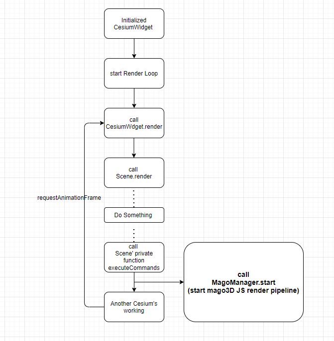
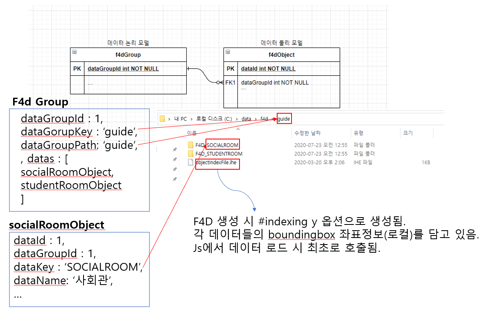

# 목차

1. [소개](#1-소개)
2. [Dependency](#2-dependency)
3. [Test  환경 설치](#3-test-환경-설치)
4. [시작하기](#4-시작하기)
5. [Data 등록](#5-data-등록)
6. [API 소개](#6-api--소개)
7. [이벤트 처리](#7-이벤트-처리)


## 1. 소개

- **각종 3D 데이터들을 전세계 Globe위에서 표출하고 다루기 위한 JAVASCRIPT 라이브러리.**


## 2. Dependency 

- mago3D JS는 기본적으로 CesiumJS를 필요로 합니다. CesiumJS의 렌더링 pipeline에 코드를 삽입하여 mago3D JS에서 사용하는 데이터(F4D)를 렌더링하고 각종 기능들을 수행합니다. 그래서 mago3D JS는 작업된 CesiumJS를 함께 배포합니다.

   mago3D JS를 사용 시 CesiumJS에서 제공하는 모든 기능들을 사용할 수 있습니다. (import한 cesium.js 버전에 따라 기능에 차이가 있음)



 

​       그리하여 mago3D JS를 사용 시 배포해드리는 cesium.js를 임포트한 후 사용합니다.

```
<link rel="stylesheet" href="./cesium/Widgets/widgets.css" />
<script src="./cesium/Cesium.js"></script>
```


## 3. Test 환경 설치

[mago3D JS github page (설치 과정 참조)](https://github.com/Gaia3D/mago3djs)

- 설치과정 **4,5(일부),6 생략**
- 추가 작업 내용
  \- branch를 feature/3.0 으로 변경 (git clone -b feature/v3.0 --single-branch https://github.com/Gaia3D/mago3djs.git )
  \- [샘플 f4d 파일 다운로드](https://gaia3d-my.sharepoint.com/personal/jhkwun_gaia3d_com/Documents/mago3djs guide f4d/guide.zip)
  \- (설치과정 5번 마지막에 해당 내용포함) f4d를 서비스할 폴더를 링크.(mklink /d “mago3djs repository path“\f4d “data path“       ex : mklink /d D:\repository\mago3djs\f4d D:\data\f4d)  
  \- [Test page](http://localhost/sample/guide.html)


## 4. 시작하기

```

		/**
		 * @param {Stirng} containerId container div id. required.
		 * @param {object} serverPolicy mage3d geopolicy. required.
		 * @param {object} callback loadstart callback, loadend callback. option.
		 * @param {object} options Cesium viewer parameter. option.
		 * @param {Cesium.Viewer} legacyViewer 타 시스템과의 연동의 경우 view 객체가 생성되어서 넘어 오는 경우가 있음. option.
		*/
        var MAGO3D_INSTANCE= new Mago3D.Mago3d('magoContainer', geoPolicyJson, {loadend : magoLoadEnd}, cesiumViewerOption);
        
        function magoLoadEnd(e) {
            //mago3d loae end 콜백 실행 시 Mago3D 인스턴스와 동일한 객체가 넘어옴
            var mago3d = e;
            
            //mago3d 메인 클래스. 
            var magoManager = mago3d.getMagoManager();
            
            //cesium Viewer 객체
            var viewer= mago3d.getViewer();
            
            //f4d 등록 및 제거 시 사용
            var f4dController= mago3d.getF4dController();
        }
```

- serverPolicy 주요항목

| 변수명                                     | **설명**                                                     | **필수** | **기본값**         | **type** |
| :----------------------------------------- | :----------------------------------------------------------- | :------- | :----------------- | :------- |
| `basicGlobe`                               | javscript 3d Globe. 기본적으로 ‘cesium’을 사용하며 ‘magoworld’ 옵션을 사용 가능 | Y        | `'cesium'`         | string   |
| `cesiumIonToke`                            | Cesium Ion Token 보유 시 사용. 토큰 등록 시에만 Ion 서비스 이용가능. | N        |                    | string   |
| `terrainType`                              | terrain 형태.   **cesium-default** : 실제 지형표현이 없는 구 형태의 globe **cesium-ion-default** : Cesium Ion 기본 terrain. Cesium Ion Token 사용 시에만 사용가능 **cesium-ion-cdn** : Cesium Ion에 등록한 terrain 을 호출하여 사용.  terrainValue에 해당 assetId를 설정. Cesium Ion Token 사용 시에만 사용가능 **cesium-customer** : 사용자가 직접 생성한 cesium terrain을 사용 시 설정(예를 들면 ctb를 이용하여 생성한 terrain을 cts를 통해 서비스할 경우).  terrainValue에 terrain 서비스 url을 등록. **geoserver** : geoserverTerrainProvider를 이용하여 터레인을 서비스 할 경우 사용. (비추) |          | `'cesium-default'` | string   |
| `terrainValue`                             | terrainType에 맞는 값 설정.                                  |          |                    | string   |
| `online`                                   | 시스템 사용 환경의 온오프라인 유무                           |          | `true`             | boolean  |
| `geoserverEnable`                          | GeoServer 서비스 사용 유무.                                  |          |                    | boolean  |
| `geoserverImageproviderEnable`             | GeoServer에서 서비스하는 배경지도를 이용 시, true로 설정     |          | `false`            | boolean  |
| `geoserverImageproviderUrl`                | GeoServer WMS urlexample : ‘http://localhost:8080/geoserver/wms’ |          |                    | string   |
| `geoserverImageproviderLayerName`          | 서비스할 레이어명                                            |          |                    | string   |
| `geoserverImageproviderStyleName`          | 적용할 스타일명                                              |          |                    | string   |
| `geoserverImageproviderParametersWidth`    | 이미지 가로 사이즈                                           |          | 256                | number   |
| `geoserverImageproviderParametersHeight`   | 이미지 세로 사이즈                                           |          | 256                | number   |
| `geoserverImageproviderParametersFormat`   | 이미지 포맷                                                  |          | ‘image/jpeg’       | string   |
| `geoserverTerrainproviderLayerName`        | terrainType 이 geoserver일 시, GeoserverTerrainProvider를 통해 terrain으로 서비스할 레이어명 |          |                    | string   |
| `geoserverTerrainproviderStyleName`        | terrainType 이 geoserver일 시, terrain에 적용할 스타일 명    |          |                    | string   |
| `geoserverTerrainproviderParametersWidth`  | 이미지 가로 크기                                             |          | 256                | number   |
| `geoserverTerrainproviderParametersHeight` | 이미지 높이 크기                                             |          | 256                | number   |
| `geoserverTerrainproviderParametersFormat` | 이미지 포맷                                                  |          |                    | string   |
| `initCameraEnable`                         | globe 시작 시, 시작 위치로 이동 기능 사용 유무               |          |                    | boolean  |
| `initLatitude`                             | 시작 위도                                                    |          |                    | number   |
| `initLongitud`                             | 시작 경도                                                    |          |                    | number   |
| `initAltitude`                             | 시작 고도                                                    |          |                    | number   |
| `initDuration`                             | 시작 위치로 이동하는 시간, 0으로 지정 시 애니메이션 효과 없음. |          |                    | number   |
| `lod0`                                     | lod0 레벨 표출 거리                                          |          | 15                 | number   |
| `lod1`                                     | lod1 레벨 표출 거리                                          |          | 60                 | number   |
| `lod2`                                     | lod2 레벨 표출 거리                                          |          | 90                 | number   |
| `lod3`                                     | lod3 레벨 표출 거리                                          |          | 200                | number   |
| `lod4`                                     | lod4 레벨 표출 거리                                          |          | 1000               | number   |
| `lod5`                                     | lod5 레벨 표출 거리                                          |          | 50000              | number   |

- Cesium Viewer 

[Cesium Viewer document page](https://cesium.com/docs/cesiumjs-ref-doc/Viewer.html) 


## 5. Data 등록



```
function magoLoadEnd(e) {
    var mago3d = e;
  
    //f4d 등록 및 제거 시 사용
    var f4dController= mago3d.getF4dController();
    
    var f4dGroup = {
        "metainfo": {
            "isPhysical": false
        },
        "dataGroupId":1,
        "dataGroupKey":"guide",
        "dataGroupName":"가이드 데이터 그룹",
        "dataGroupPath":"guide",
        "datas": []
    };
    
    var socialRoomObject= {
        "metainfo": {
            "isPhysical": true,
            "flipYTexCoords": true
        },
        "dataId" : 1,
        "dataGroupId" : 1,
        "dataKey": "SOCIALROOM",
        "dataName": "SOCIALROOM",
        "mappingType":"origin",
        "longitude": 128.917656,
        "latitude": 35.139482,
        "height": 14.177629,
        "heading": 0.000000,
        "pitch": 0.000000,
        "roll": 0.000000
    };
    
    f4dGroup.datas.push(socialRoomObject);
    
    f4dController.addF4dGroup(f4dGroup);
}
```

**f4dGroup**

f4d 데이터 그룹. 

##### Type:

- Object

##### Properties:

| Name            | Type              | Description                             |
| :-------------- | :---------------- | :-------------------------------------- |
| `dataGroupId`   | string            | Required. f4d 레이어의 고유 아이디.     |
| `dataGroupKey`  | string            | Required. 레이어 폴더 매칭 키           |
| `dataGroupName` | string            | Required. 레이어 명                     |
| `dataGroupPath` | string            | Required. 레이어 폴더 경로              |
| `tiling`        | boolean           | optional. 타일링 유무                   |
| `datas`         | Array.<f4dObject> | optional. 해당 레이어에 포함된 f4d 목록 |
| `longitude`     | number            | optional. 데이터 그룹 대표 경도,        |
| `latitude`      | number            | optional. 데이터 그룹 대표 위도,        |
| `altitude`      | number            | optional. 데이터 그룹 대표 높이,        |
| `metainfo`      | object            | 속성.                                   |

 

**f4dObject**

f4d 데이터 object

##### Type:

- Object

##### Properties:

| Name | Type | Description |
| :--- | :--- | :---------- |
|      |      |             |

| Name          | Type   | Description                                                  |
| :------------ | :----- | :----------------------------------------------------------- |
| `dataId`      | string | Required. 데이터 고유 아이디                                 |
| `dataGroupId` | string | Required. 데이터의 레이어 아이디                             |
| `dataKey`     | string | Required. 데이터 폴더명                                      |
| `dataName`    | string | Required. 데이터 이름                                        |
| `dataType`    | string | optional. 데이터 타입.                                       |
| `mappingType` | string | optional. case 'origin', 'boundingboxcenter', boudingboxbottomcenter'. default is 'origin' |
| `longitude`   | number | Required. 경도,                                              |
| `latitude`    | number | Required. 위도,                                              |
| `altitude`    | number | optional. 높이, 숫자형태면 무관. default is 0.               |
| `heading`     | number | optional. heading,  default is 0.                            |
| `pitch`       | number | optional. pitch, default is 0.                               |
| `roll`        | number | optional. roll,default is 0.                                 |
| `metainfo`    | object | Required. isPhysical 키에 true값이 필수적으로 매칭되어야함.  ex : {isPhysical : true} |

 

## 6. API  소개

- changeBoundingBoxAPI(`MAGO3D_INSTANCE`, isShow);
- changeLabelAPI(`MAGO3D_INSTANCE`, isShow);
- changeObjectMoveAPI(`MAGO3D_INSTANCE`, “0“);
- gotoFlyAPI(`MAGO3D_INSTANCE`, longitude, latitude, altitude , duration);
- searchDataAPI(`MAGO3D_INSTANCE`, dataGroupId , dataKey);


## 7. 이벤트 처리 

```
function loadend(e) {
        console.info('Complete construct mago3d instance. Enjoy!');
        
        var magoInstance = e;
        var magoManager = magoInstance.getMagoManager();
        
        var f4dController = magoInstance.getF4dController();
        
        var f4dGroup = ...

        var socialRoomObject = ...
        f4dGroup.datas.push(socialRoomObject);
        f4dController.addF4dGroup(f4dGroup);

        magoManager.once(Mago3D.MagoManager.EVENT_TYPE.SELECTEDF4D, function(e) {
            console.log('selected f4d event once trigger');
            var studentRoomObject= {
                "metainfo": {
                    "isPhysical": true,
                    "flipYTexCoords": true
                },
                "dataId" : 1,
                "dataGroupId" : 1,
                "children": [],
                "dataKey": "STUDENTROOM",
                "dataName": "STUDENTROOM",
                "mappingType":"origin",
                "longitude": 128.919656,
                "latitude": 35.138482,
                "height": 14.177629,
                "heading": 0.000000,
                "pitch": 0.000000,
                "roll": 0.000000
            }
            f4dController.addF4dMember(1, studentRoomObject);       
        });
        magoManager.on(Mago3D.MagoManager.EVENT_TYPE.F4DLOADEND, function(e){
            console.info(e.f4d.length + '개의 데이터가 로드되었습니다.');
        });
    }
```

- event list

  `'CLICK'`

  `'DBCLICK'`

  `'RIGHTCLICK'`

  `'MOUSEMOVE'`

  `'LEFTDOWN' `

  `'LEFTUP' `

  `'F4DLOADSTART'`

  `'F4DLOADEND' `

  `'F4DRENDERREADY'`

  `'SELECTEDF4D'`

  `'SELECTEDF4DMOVED'`

  `'SELECTEDF4DOBJECT'`

  `'SELECTEDGENERALOBJECT'`

  `'DESELECTEDF4D'`

  `'DESELECTEDF4DOBJECT'`

  `'DESELECTEDGENERALOBJECT'`

  `'CAMERACHANGED'`

  `'CAMERAMOVEEND'`

  `'CAMERAMOVESTART'`

