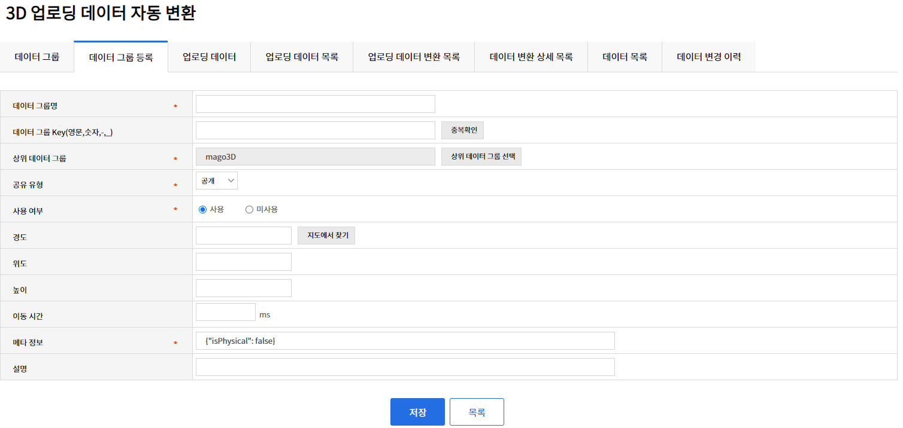
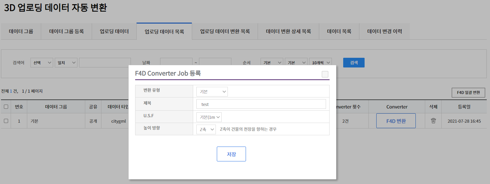
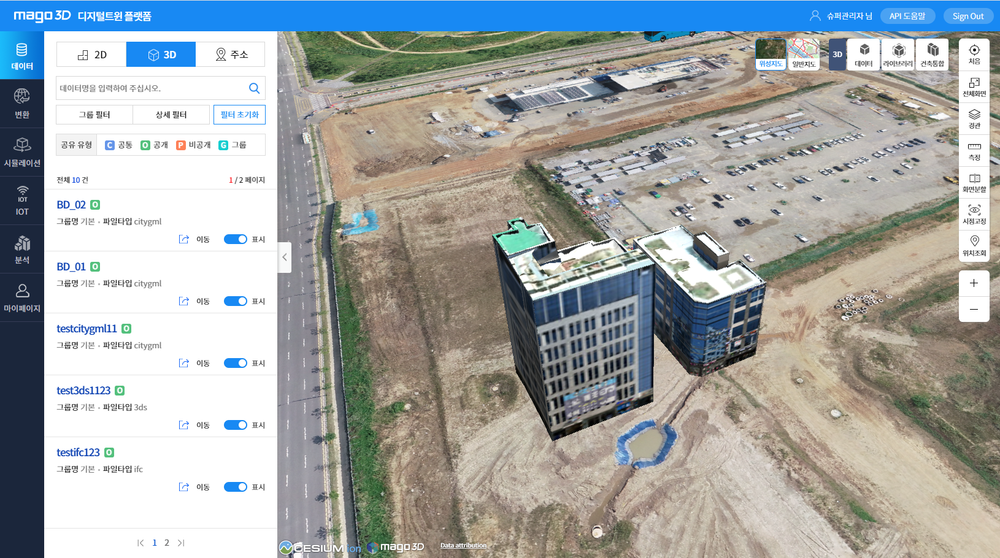
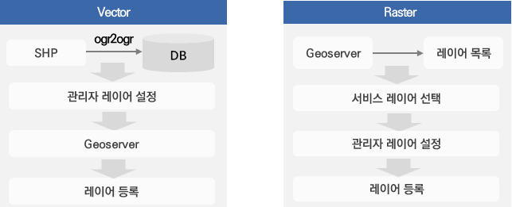
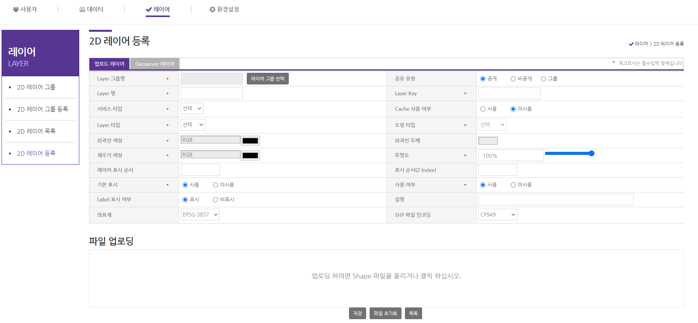
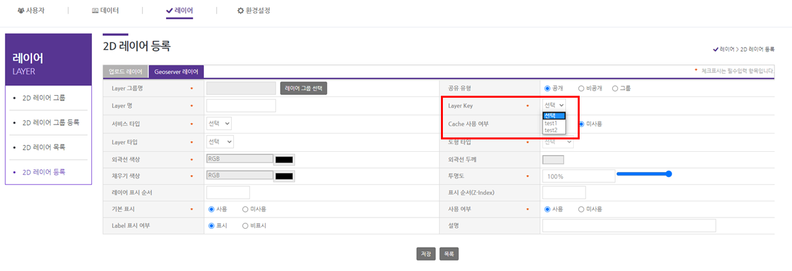
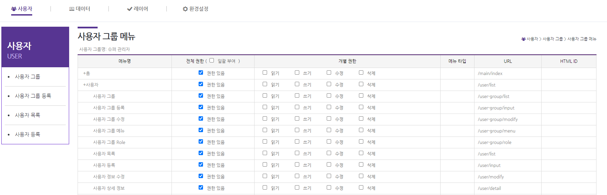

# 목차

1. [데이터 변환 및 가시화](#1-데이터-변환-및-가시화)
2. [레이어 서비스(관리자)](#2-레이어-서비스관리자)
3. [사용자 관리(관리자)](#3-사용자-관리관리자)
4. [메뉴(관리자)](#4-메뉴관리자)
5. [환경설정(관리자)](#5-환경설정관리자)

## 1. 데이터 변환 및 가시화 

- **동영상 튜터리얼**

[mago3D - 3D 데이터 변환 및 가시화](https://youtu.be/z3bUZA_jF4s) 

- 데이터 그룹

  

  

   

  - 사용자는 기본적으로 **basic** 이라는 그룹key를  가진 그룹을 가지고 사용자의 필요에 따라 추가적으로 그룹을 생성 할 수 있다.

  - 공유 유형에는 공개/공통/비공개/그룹 4가지의 유형이 있고, 유형에 따라 데이터의 그룹을 설정 할 수 있다.

    

- 데이터 업로드

  

  - 지원 포맷 : CITYGML, INDOORGML, IFC, LAS(POINT CLOUD), 3DS, OBJ, COLADA(DAE)

  - zip 파일 또는 각각의 파일을 선택하고 위치를 지정하여 데이터를 업로드 할 수 있다. 

  - 높이 설정 방법

    - 해발 고도: 사용자가 입력한 높이값 사용

    - Terrain(지형)에 맞춤: 지형에 맞춰서 높이 설정

    - Terrain(지형)으로 부터 높이 설정: 지형 위로 높이 설정

      

- 데이터 변환 

  

  - F4D 변환 버튼을 선택하여 업로드 한 파일을 F4D 포맷으로 변환한다. 

    

- 데이터 가시화 및 검색

  

  - 파일 변환이 정상적으로 완료 된 경우 지도 상에 업로드한 객체가 가시화 된다.
  - 데이터는 그룹별/타입별/데이터명으로 검색이 가능하다.

## 2. 레이어 서비스(관리자)

- **동영상 튜터리얼**

[mago3D - 2D 레이어 가시화](https://www.youtube.com/watch?v=uKpysHvppKM&t=979s) 

- Vector 레이어 등록

  

  - 레이어 등록 기능은 geoserver를 통해 이루어지기 때문에 환경설정 - 공간정보 운영정책 - **GeoServer 탭에서 데이터URL 의 geoserver 가 기동중이어야 하고, 작업공간과 저장소가 만들어져 있어야 한다.**

    

  

   

  - Vector 레이어 등록은 SHP 파일을 지원한다. 
    - 스타일 수정 : 투명도, 외곽선 두께, 외곽선/채우기 색상을 지원한다.
    - 레이어 표시 순서 및 Z-index 수정 : 레이어 표시 순서는 사용자 사이트에서 레이어 목록에 보여지는 순서이며, 값이 클수록 하단에 보여진다. Z-index 는 레이어의 겹침 순서를 뜻한다.   

- Raster 레이어 등록 

  

  - SHP 파일에 비해 용량이 큰 Raster 데이터에 대해서는 파일 업로드를 지원하지 않고 geoserver 에 등록된 레이어 목록중에서 선택해서 서비스 할 수 있는 기능을 지원한다. 

- Cache 설정 : WMS 서비스의 경우 Cache 사용 여부가 **사용**일 경우 geowebcache 를 사용하여 캐시된 데이터를 서비스 하고 **미사용** 일경우 일반 WMS 서비스를 사용한다.

## 3. 사용자 관리(관리자)

- 사용자 그룹 : 모든 사용자는 그룹을 가지고 있고 해당 그룹에 따라 볼 수 있는 메뉴와 권한이 결정된다.  

- 메뉴 관리 : 사용자 그룹이 볼 수 있는 메뉴 목록을 설정한다. 

  

   

- Role 관리 : 사용자 그룹이 사용 가능한 권한을 설정한다.

  

   

## 4. 메뉴(관리자)

- 관리자와 사용자의 메뉴를 수정/삭제/추가 할 수 있다. 

## 5. 환경설정(관리자)

- **동영상 튜터리얼**

[mago3D - 환경설정_일반운영정책 (관리자)](https://www.youtube.com/watch?v=JhZIMeW2KIM) 

[mago3D - 환경설정_공간정보운영정책 (관리자)](https://www.youtube.com/watch?v=FiCVbQC2Mj8) 

- 일반 운영정책
  - 사용자 : 사용자 생성 ID  규칙, 로그인 정책 등에 대한 설정을 한다.
  - 비밀번호 : 패스워드의 변경 주기 및 패스워드 사용 정책에 대한 설정을 한다.
  - 보안 : 세션 타임아웃 설정 및 개인정보 마스킹 처리에 대한 설정을 한다.
  - 컨텐트 :  각종 그룹의 최상위 그룹명에 대한 설정을 하고 static 한 자원들의 version 을 설정 할 수 있다. 여기서 설정한 version 은 queryString 으로 요청 url 뒤에 붙어서 static 한 자원들을 갱신하는 역할을 한다.  
  - 사용자 업로딩 파일 : 각종 업로드에 허용할 확장자 및 사이즈 등을 설정한다. 
- 공간정보 운영 정책 
  - 공간정보 : Terrain, 데이터 폴더 등에 대한 설정을 한다.
  - GeoServer : geoserver, ImageryProvider, TerrainProvider 에 관련한 설정을 한다. 

